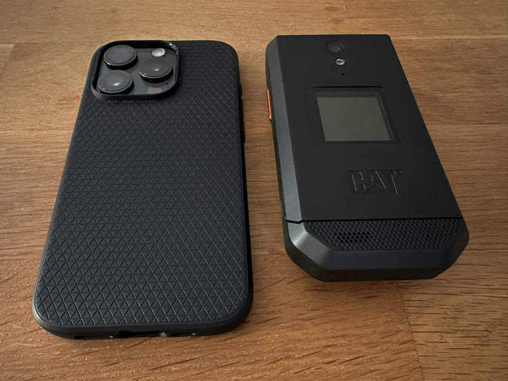
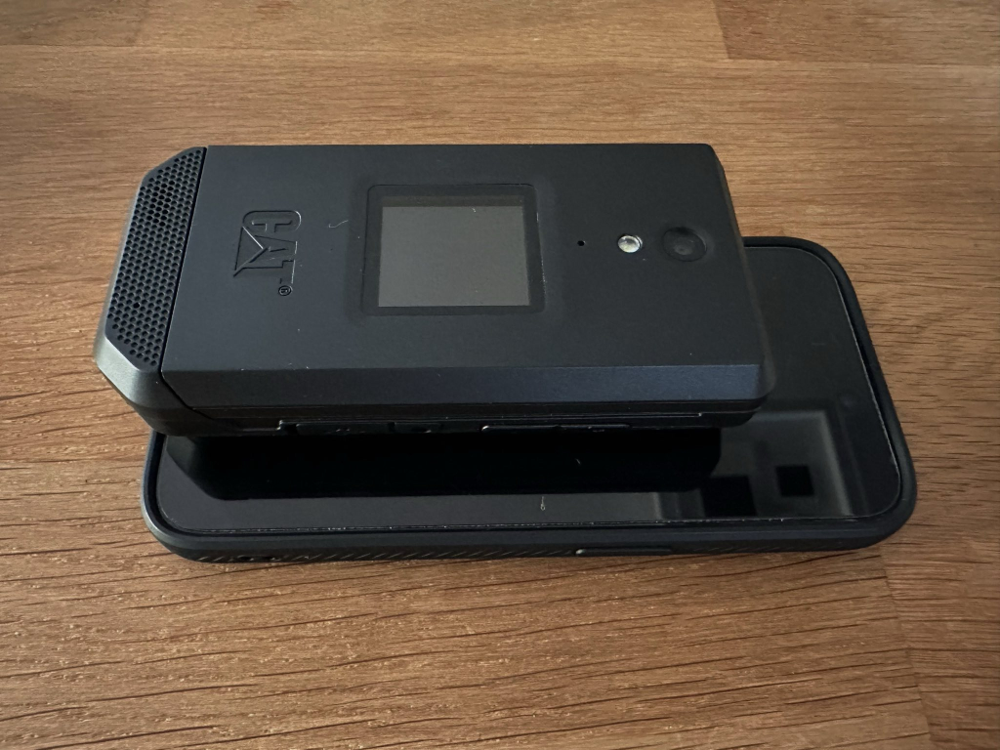
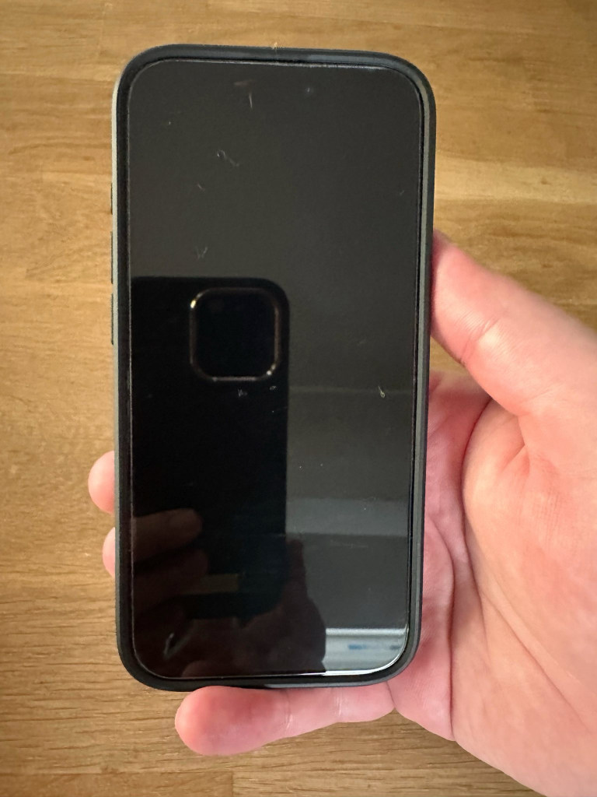
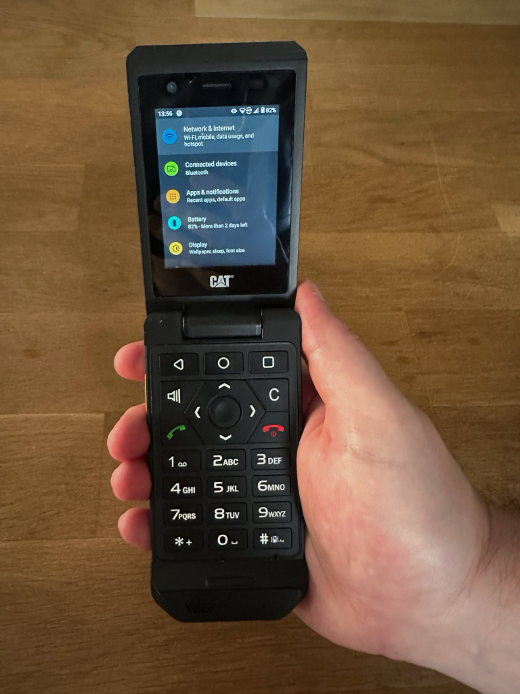
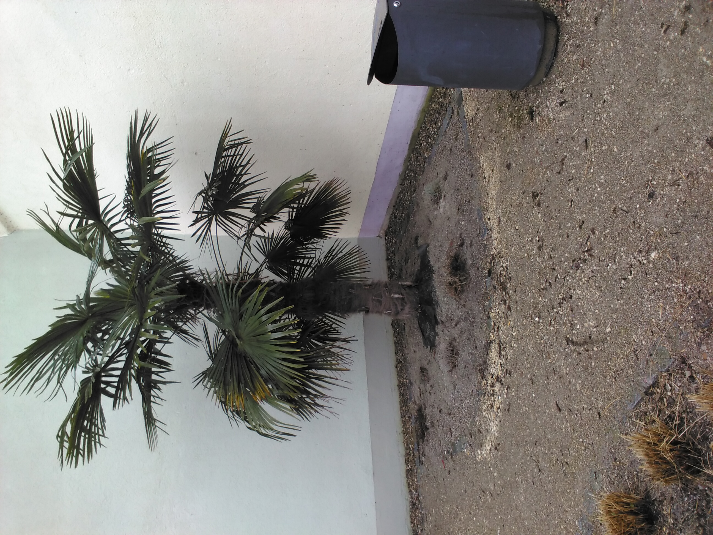
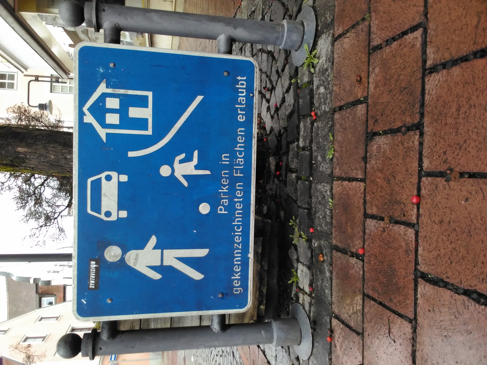


Dieser Beitrag wurde von einer KI ins Deutsche übersetzt. Der englische Originalinhalt wurde von mir verfasst. [Zum englischen Original](https://rootknecht.net/blog/cat-s22-flip/)


## Hintergrund

Ich besitze seit dem [Nokia N95](https://en.wikipedia.org/wiki/Nokia_N95) ein High-End-Smartphone, und mein jüngeres Ich dachte, das sei der Gipfel der mobilen Technologie. Oh, wie falsch ich lag :laughing:. Seitdem befand sich das jeweils aktuelle iPhone oder Galaxy (Note) immer in meiner Tasche, auf meinem Schreibtisch oder in meinem Bett.

Im Laufe der Zeit bemerkte ich eine Zunahme meiner Bildschirmzeit und meiner Handy-Nutzung. Das Smartphone fühlte sich mehr und mehr wie eine Last an, nicht wie ein Werkzeug. Ich muss erwähnen, dass ich nicht in sozialen Netzwerken aktiv bin. Na ja, außer auf Reddit. :monkey_face: Meine hauptsächliche Bildschirmzeit entsteht durch das Lesen von (Technologie-)Nachrichten und Subreddits, das Abrufen von Mails und Chats sowie durch etwas Gaming und (zielloses) Scrollen auf Amazon.

Es gibt viele Beiträge im Netz über unsere (ungesunde) Beziehung zu Smartphones, daher werde ich das nicht weiter vertiefen. Ich entschloss mich jedoch, ein Experiment zu starten. Kann ich mit einem „dümmeren" Telefon ([Feature Phone](https://en.wikipedia.org/wiki/Feature_phone) oder Dumbphone) leben und arbeiten? Wird ein mobiles Gerät wieder ein Werkzeug in meiner Sammlung sein und keine Ablenkungsmaschine, wie wir alle es gewohnt sind?

## Die Auswahl eines neuen Telefons

Überraschenderweise (oder nicht) war es nicht einfach, ein Gerät zu finden, das das Gefühl vermittelte, mein iPhone 15 Pro ersetzen zu können. Trotz der großen Auswahl an Nokia-Geräten und der Kategorie der „Seniorentelefone" fehlt ein entscheidendes Feature: [Signal](https://www.signal.org/de/). Mein neues Gerät muss in der Lage sein, Signal-Nachrichten zu verarbeiten, sowie natürlich Anrufe und SMS.

Im Folgenden eine (unvollständige) Liste von Telefonen, die ich mir angesehen habe:

- Das [Punkt MP02](https://www.punkt.ch/en/products/mp02-4g-mobile-phone/) ist ein Premium-Feature-Phone mit Signal-Unterstützung (über Pigeon). Leider funktioniert der Signal-Client nur mit einem neuen Konto. [Hilfreiche Rezension auf YouTube](https://www.youtube.com/watch?v=QdYrBpBJRI4).
- Das [Light Phone II](https://www.thelightphone.com/) ist ein weiteres Premium-Feature-Phone mit E-Ink-Display. Ich liebe E-Ink! Leider ist dieses Gerät derzeit nicht in Deutschland erhältlich (wahrscheinlich wegen der Bandfrequenzen) und bietet keine Signal-Unterstützung.
- [Mudita Pure](https://mudita.com/products/phones/mudita-pure/) ist ein weiteres Premium-Feature-Phone, das seit einer Weile nicht vorrätig ist.
- Ich konnte keinen vernünftigen Verkäufer für ein [Xiaomi Qin F21](https://gagadget.com/de/89279-qin-f21-pro-das-tastenhandy-aus-xiaomis-okosystem-mit-einem-28-zoll-bildschirm-wi-fi-selfie-kamera-und-android-os-an-bord-/) oder ein [Xiaomi Qin F22](https://gagadget.com/de/announce/148313-xiaomi-hat-den-verkauf-des-qin-f22-pro-gestartet-ein-tastenhandy-mit-mediatek-helio-g85-chip-frontkamera-usb-c-u/) finden. Außerdem bezweifle ich, dass sie in Deutschland funktionieren würden...
- Verschiedene Nokia-Geräte und Telefone anderer Marken, die [KaiOS](https://www.kaiostech.com/) oder ein anderes proprietäres Betriebssystem betreiben, das Signal-Unterstützung durchgängig vermissen lässt.

Es ist nicht einfach, der Smartphone-Welt zu entkommen. :laughing:

Im Dezember 2023 stieß ich auf das [CAT S22 Flip](https://www.gsmarena.com/cat_s22_flip-11141.php), ein Klapptelefon, das [Android Go](https://www.android.com/versions/go-edition/), eine abgespeckte Android-Version, aber immer noch Android betreibt! Als Android-Telefon unterstützt es Signal! Großartige Nachricht! :partying_face:

Aber da es ein Android-Telefon ist, kann es doch kein Feature-Phone sein, oder? Tausche ich ein Smartphone gegen ein anderes? Ich kann Ihnen jetzt schon sagen: NEIN! Ja, es läuft Android, und ja, es unterstützt Google Play. Aber seine Hardware ist so begrenzt (in diesem Fall positiv :laughing:), dass man damit nicht viel anstellen wird. Dazu später mehr!

## Das S22 Flip

Ich werde nicht im Detail auf die technischen Daten des Telefons eingehen, da es genügend Ressourcen im Netz gibt. Schauen Sie sich auch den Abschnitt [Links](#links) für einige YouTube-Links an. Was mich zum Kauf des Flip bewegt hat:

1. Es hat Android, also weiß ich, was mich erwartet.
2. Es ist ein Klapptelefon! Ich meine, ich bin alt genug, um stolz ein O.G. [Moto Razr](https://en.wikipedia.org/wiki/Motorola_Razr) besessen zu haben. Muss ich mehr sagen?
3. Es war nicht teuer. Einige Besitzer kauften es 2023 für ca. 60 $; ich kaufte es im Januar 24 für 87 €, und der Preis stieg auf über 100 € auf Amazon.de. Jetzt (Februar 24) ist es nicht mehr auf Amazon.de erhältlich.

## Kauf und Lieferung

Ich kaufte meins für 87 € auf Amazon.de als UK-Import (ich wohne in Deutschland). Die Lieferung dauerte eine Woche, und der Preis beinhaltete Versand und Zoll, sodass es wie ein normales Paket geliefert wurde. Es sollte erwähnt werden, dass das Gerät ursprünglich nur in den USA als T-Mobile-Exklusivgerät veröffentlicht wurde. Es war anscheinend kein großer Erfolg, und die Produktion wurde eingestellt. Einige Verkäufer kauften diese Geräte jedoch und verkaufen sie entsperrt weiter. Mein Gerät kam mit einem nicht EU-kompatiblen Ladegerät. Ich verwende einfach eines der vielen Kabel und Ladegeräte, die ich bereits habe. Im Lieferumfang war auch ein USB-C-auf-Klinkenstecker-Adapter enthalten.

## Hardware

> The S22 Flip is a rugged device that you can depend on no matter if you are a first responder on the front line or a farmer out in the field[^1]

Genau das Gerät für mich. :stuck_out_tongue_winking_eye:

Spaß beiseite, es ist ein großes und klobiges Gerät, aber zumindest schmaler als ein iPhone.





Es fühlt sich etwas seltsam in der Hosentasche an, aber es ist in Ordnung. Mal sehen, wie das im Sommer funktioniert. Was mir an der Hardware wirklich gefällt, ist das Klapp-Scharnier, das sehr knackig ist und beim Schließen ein befriedigendes Geräusch macht.

Meiner Meinung nach ist es viel angenehmer zu halten als ein herkömmliches Smartphone, besonders da ich das S22 nicht mit dem kleinen Finger halten muss. Es lässt sich auch besser aufheben dank seiner Sperrigkeit und passt perfekt in meine Hand. Kurz gesagt, die Ergonomie ist besser als bei modernen schmalen und glatten Smartphones. Wie man sich aus den folgenden Bildern vorstellen kann, ist das Flip deutlich angenehmer zu halten.





Endlich muss ich mir keine Sorgen mehr um Kratzer, Stürze oder sogar ein Case machen! Es fühlt sich eher wie ein Hammer an als ein glänzendes und zerbrechliches Stück Hightech.

Natürlich genieße ich auch das Gefühl von echten Tasten, obwohl das D-Pad sich etwas weich anfühlt, aber das ist nicht weiter schlimm. Seltsamerweise wird das Nummernfeld von der Standard-Software nicht gut unterstützt, aber dazu mehr im Abschnitt [Software](#software).

Eine weitere äußerst praktische Erfahrung ist die große orangefarbene programmierbare Taste. Ich habe sie der sehr hellen Taschenlampe zugewiesen. So praktisch wie eine echte Taschenlampe.

Ehrlich gesagt möchte ich das Flip mehr nutzen, als ich es brauche, wegen seines Gefühls und vielleicht der Nostalgie :laughing:

## Die Kamera

Nun, was kann man von einer 5-Megapixel-Kamera aus dem Jahr 2019 erwarten? Sie funktioniert und erfüllt ihren Zweck als Hilfsmittel. Zum Beispiel, um etwas festzuhalten, das man sich merken möchte, und es danach zu löschen. Die Bilder sind in Ordnung, aber sie werden keinen Wettbewerb gewinnen. Hier sind einige Beispielbilder, die mit meinem Flip aufgenommen wurden.





Alle Beispiele direkt aus der Kamera. Einfach drauf und drücken.

## Software

Ich muss erwähnen, dass meins nur mit Englisch, Spanisch und Französisch vorinstalliert war, was für mich kein Problem ist, da alle meine Geräte auf Englisch eingestellt sind. Die Sprache sollte auf jede von Android unterstützte Sprache umgestellt werden können.

Nach dem ersten Start erhielt ich sofort ein 1,2-GB-Systemupdate, aber immer noch für Android 11. Es gibt kein offizielles Update auf Android 12.

Ich wurde etwas nervös, weil das Flip SIM-gesperrt war. :hushed: Es stellte sich heraus, dass ich die SIM-Sperre in `Einstellungen` - `Über das Telefon` - `Entsperren` einfach entfernen konnte. Ich habe natürlich die dauerhafte Entsperrung gewählt.

Da es sich um eine T-Mobile-exklusive Hardware handelt, war die Standard-Software ziemlich vollgestopft mit Trackern und allem Möglichen. Wer sich mit dem Rooten nicht wohl fühlt, könnte den [Universal Android Debloater](https://github.com/0x192/universal-android-debloater) ausprobieren. Dieses Tool konnte jedoch einige T-Mobile/Sprint-Apps nicht verarbeiten, da es sich um System-Apps handelt, für die Root-Rechte notwendig sind. Früher, als ich noch mehr Zeit hatte, spielte ich jede Woche eine andere Custom-ROM auf mein Galaxy auf, daher bin ich mit dem allgemeinen Prozess und den Tools etwas vertraut. Es gibt eine ausgezeichnete Anleitung in den [XDA-Foren](https://xdaforums.com/t/tut-root-how-to-root-cat-s22-flip-on-version-30.4626971/), um das Flip zu rooten und alle unnötigen System-Apps wirklich zu entfernen.

Wie bereits erwähnt, ist die Software nicht so gut darin, Aufgaben über das Nummernfeld zu erledigen. Ich habe daher einige alternative Software installiert. Außerdem war es mein Ziel, das Gerät so weit wie möglich zu „de-googeln". In erster Linie nicht aus Datenschutzgründen, sondern der Einfachheit und Akkulaufzeit halber.

### Google Play

- [Nova Launcher](https://play.google.com/store/apps/details?id=com.teslacoilsw.launcher&hl=en_US&gl=US) (ich habe Nova Prime von früher)
- [Simple Gallery Pro](https://play.google.com/store/apps/details?id=com.simplemobiletools.gallery.pro&hl=en_US&gl=US) – ich konnte keine gute Alternative auf F-Druid finden

Nach der Installation dieser Apps habe ich mein Google-Konto entfernt und so viele Google-Pakete gelöscht, wie ich mich traute, ohne das Gerät zu bricken :laughing:

### F-Druid[^2]

- [Magisk](https://f-droid.org/en/packages/com.topjohnwu.magisk/)
- [De-bloater](https://f-droid.org/en/packages/com.sunilpaulmathew.debloater/) – ein Magisk-Modul, um buchstäblich alles zu entfernen (erfordert Root)
- [TT9](https://github.com/sspanak/tt9) (ich hörte, dass die eingebaute T9-Tastatur einige Probleme hat)
- [Material Files](https://f-droid.org/en/packages/me.zhanghai.android.files/) (Dateimanager)
- [Monocoles Browser](https://f-droid.org/en/packages/de.monocles.browser/) (Webbrowser)
- [Notally | Minimalist Notes](https://f-droid.org/en/packages/com.omgodse.notally/)
- [omWeather](https://f-droid.org/packages/org.woheller69.omweather/)
- [Simple Alarm Clock](https://f-droid.org/packages/com.better.alarm/)
- [Simple Calendar Pro](https://f-droid.org/en/packages/com.simplemobiletools.calendar.pro/)
- [QR Scanner](https://f-droid.org/de/packages/com.secuso.privacyFriendlyCodeScanner/)
- [Molly](https://github.com/mollyim/mollyim-android) (erweiterter Signal-Client)
- [DAVx^5](https://f-droid.org/packages/at.bitfire.davdroid/) – ein sehr leistungsfähiger [CalDAV](https://en.wikipedia.org/wiki/CalDAV)- und [CardDAV](https://en.wikipedia.org/wiki/CardDAV)-Client zur Synchronisierung von Kontakten und Kalender

Das war's! Keine E-Mail, keine sozialen Medien, kein Reddit, keine Spiele, nichts.

## Akku

Hier ist eine kurze Zeitlinie der Akkulaufzeit in den ersten Tagen. Ich hatte mehr erwartet, aber es ist für mich völlig akzeptabel.


timeline
title Akkuverbrauch und Aufladen meines S22 Flips
section Erstes Entleeren
29.01 Abend : 100%
01.02 18#58;30 : 2%
section Aufladen
01.02 19#58;30 : 80%
01.02 20#58;15 : 100%
section Zweites Entleeren
03.02 13#58;50 : 63%
03.02 13#58;52 : 35%
: Plötzliches Entleeren von einem 2-Minuten Anruf
05.02 12#58;45 : 15%
05.02 13#58;45 : 8%
: After 15% is looks like to drop really fast
: Nach 15% richtig schnelles Entleeren
05.02 15#58;00 : 3%
section Zweites Aufladen
05.02 16#40;00 : 80%
05.02 17#40;00 : 100%



Bedenken Sie, dass die Akkulaufzeit von vielen Faktoren abhängt. Zum Beispiel hatte ich während eines vollen Akku-Zyklus kaum 1 Stunde Bildschirmzeit!


## Vor- und Nachteile

Die Nachteile sollte man mit einem Augenzwinkern betrachten, da einige davon besonders nützlich sind, wenn man beabsichtigt, das Telefon weniger zu nutzen :laughing:

| Vorteile                         | Nachteile                         |
| -------------------------------- | --------------------------------- |
| Preis                            | Klobig                            |
| Robustheit                       | Begrenzter Bildschirm             |
| Android                          | Altes Android                     |
| Klapptelefon                     | Kein NFC                          |
| Programmierbarer Knopf           | Kein Fingerabdrucksensor          |
| Touchscreen                      | Keine Face ID                     |
| Angenehm zu halten               | Kein Audioklinkenanschluss        |
| Physische Tasten                 | Außendisplay zeigt wenig Info[^3] |
| Auswechselbarer Akku             | Viel Bloatware                    |
| SD-Kartensteckplatz              | Einige Neustarts                  |
| Keine Angst vor Kratzern         | Plötzliche Akkueinbrüche          |
| Vibration bei angenommenem Anruf |                                   |

## Fazit

Ich mag das Gefühl eines robusten und einfachen Geräts, das nicht wie ein rohes Ei behandelt werden muss und das bei einem kleinen Kratzer nicht frustrierend wird. Es ist erfrischend, das Telefon nur für seinen ursprünglichen Zweck (Anrufe) zu nutzen. Obwohl es technisch gesehen ein Smartphone ist, ist die „clevere" Nutzung ziemlich schwierig, was eine natürliche Barriere schafft.

Es gibt jedoch einige „smarte" Funktionen, die ich vermisse. Zum einen ist die Möglichkeit, mit dem Telefon zu bezahlen, sehr praktisch[^4]. Außerdem gibt es einige Apps, die ich lieber nicht darauf installieren würde, darunter alle meine Banking- und MFA-Programme (Multi-Faktor-Authentifizierung)[^5]. Mir fehlen auch manchmal einige „Quality-of-Life"-Apps: Lieferando, GitHub, ein guter Browser, Amazon usw.

Aber meine größte Kritik betrifft die Kamera. Ich brauche meine Kamera nicht oft, aber ich möchte nicht abwägen müssen, ob heute so ein Tag ist, und dann noch mein iPhone mitschleppen.

Zusammenfassend lässt sich sagen, dass das S22 Flip meine minimalen Anforderungen erfüllt und meine Bildschirmzeit deutlich reduziert hat. Ich bin jedoch noch nicht an dem Punkt, wo es mein iPhone vollständig ersetzen kann.

## Links

- <https://www.youtube.com/@DumbphonesUK>
- <https://www.youtube.com/watch?v=AOfq-wZqNoc> (Deutsch)
- <https://www.youtube.com/watch?v=GVzuT6eYZUA&t=364s>
- <https://www.youtube.com/@oareyou>
- <https://www.youtube.com/watch?v=x_gekpsoIuY>
- <https://www.youtube.com/watch?v=xN4MuUkzLlg>

[^1]: [Offizieller](https://www.catphones.com/en-us/cat-s22-flip/) Marketing-Satz :wink:

[^2]: [F-Druid](https://f-droid.org/en/) ist ein alternativer App-Store mit freier und Open-Source-Software.

[^3]: Das Außendisplay kann keine Benachrichtigungen von Apps anzeigen. Nur verpasste Anrufe und SMS werden angezeigt.

[^4]: Ich trage immer meine Plastikkarten bei mir, weil es immer vorkommen kann, dass ein Kartenlesegerät nicht mit dem Mobiltelefon funktioniert. Allerdings erfordert das Bezahlen mit Apple Pay keine PIN-Eingabe am Terminal, was äußerst praktisch ist.

[^5]: Aufgrund der alten Android-Version und der damit verbundenen Sicherheitspatches.
