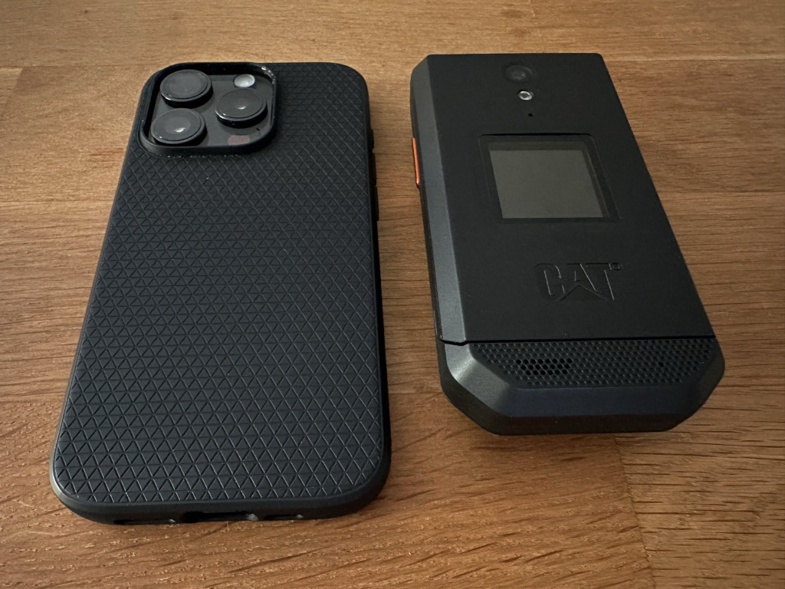
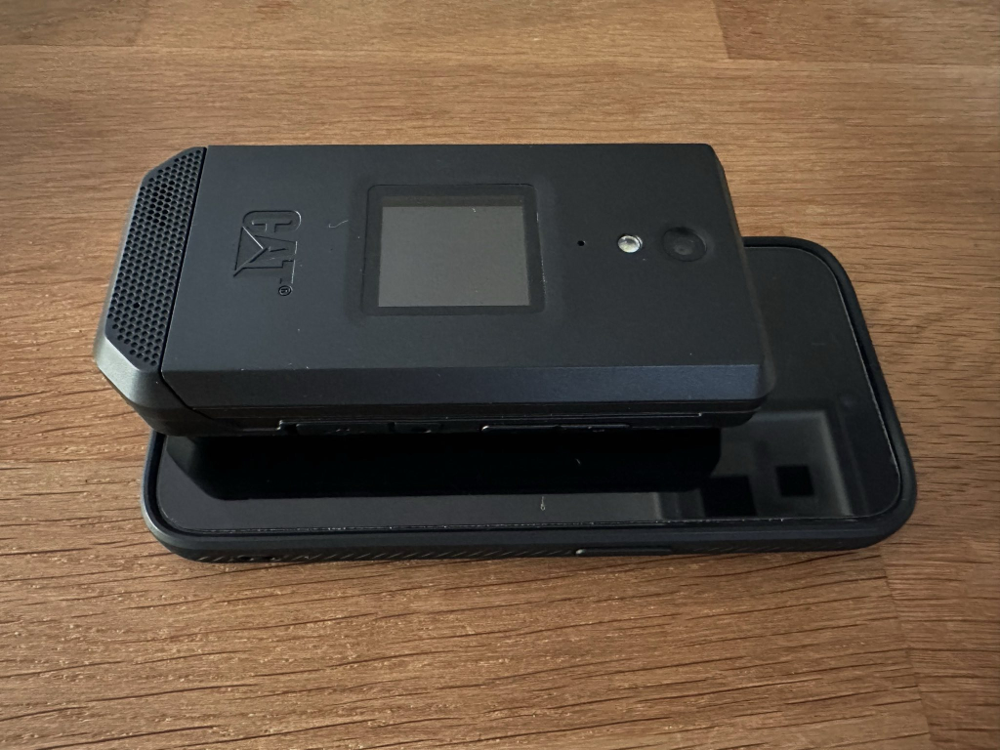
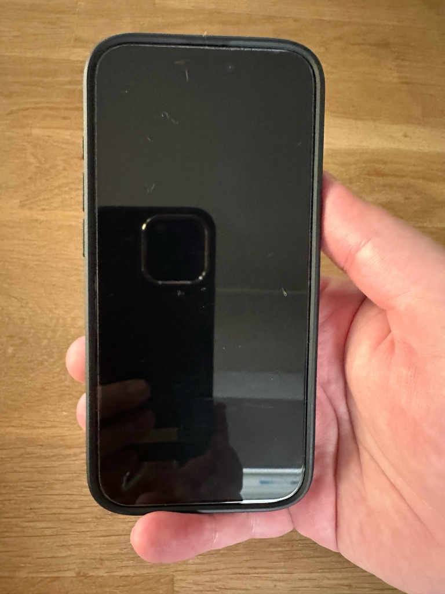
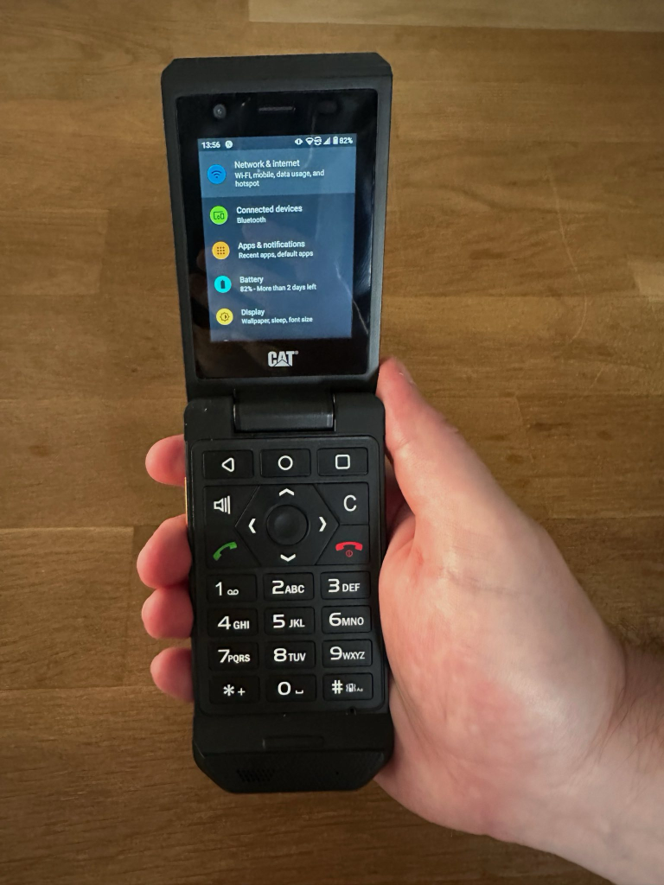
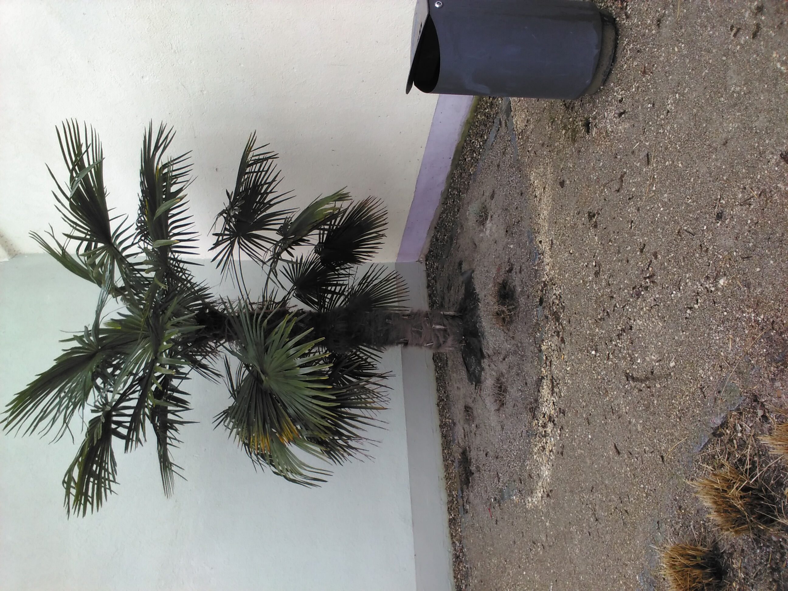
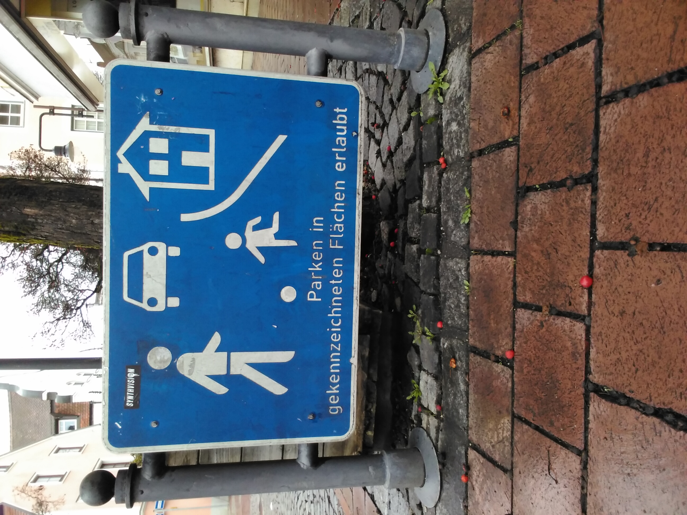

## Background

I have owned a high-end smartphone since the [Nokia N95](https://en.wikipedia.org/wiki/Nokia_N95) and my younger self thought that this must be the peak of mobile technology. Oh, boy, was I wrong :laughing:. Since then, the current iPhone or Galaxy (Note) model has always been in my pocket, at my desk, or in my bed.

Over the time, I noticed an increase in my screen time and frequency of using my phone. The smartphone felt more and more like a burden and not a tool. I have to mention that I am not active on social networks. Well, besides Reddit. :monkey_face: My main screen time results from checking (technology) news and Subreddits, my mails and chats, and some gaming and (mindless) scrolling on Amazon.

You can find plenty of people talking about our (unhealthy) relationship with smartphones on the web, so I won't go into more details. However, I decided to start an experiment. Can I live and work with a "dumber" phone ([feature phone](https://en.wikipedia.org/wiki/Feature_phone) or dumb phone)? Will a mobile device again be a tool in my toolbox and not the distraction machine we are all used to?

## Picking a new phone

Surprisingly (or not), it was not easy to find a device that gave me the feeling it could replace my iPhone 15 Pro. Despite the wide range of devices from Nokia, and the "senior phone" category, one crucial feature is missing on those devices: [Signal](https://www.signal.org/de/). My new device must be capable of handling Signal messages, as well as phone calls and SMS, of course.

What follows is a (not comprehensive) list of phones, I looked at:

- The [Punkt MP02](https://www.punkt.ch/en/products/mp02-4g-mobile-phone/) is a premium feature phone with Signal support (via Pigeon). Unfortunately, the Signal client works only with a new account. [Helpful review on YouTube](https://www.youtube.com/watch?v=QdYrBpBJRI4).
- The [Light Phone II](https://www.thelightphone.com/) is another premium feature phone with an e-ink display. I really love e-ink! Sadly, this device is currently not available in Germany (probably due to band frequencies) and it does not offer signal support.
- [Mudita Pure](https://mudita.com/products/phones/mudita-pure/) is another premium feature phone that has been out of stock for a while.
- I was unable to find a decent seller for a [Xiaomi Qin F21](https://gagadget.com/de/89279-qin-f21-pro-das-tastenhandy-aus-xiaomis-okosystem-mit-einem-28-zoll-bildschirm-wi-fi-selfie-kamera-und-android-os-an-bord-/) or a [Xiaomi Qin F22](https://gagadget.com/de/announce/148313-xiaomi-hat-den-verkauf-des-qin-f22-pro-gestartet-ein-tastenhandy-mit-mediatek-helio-g85-chip-frontkamera-usb-c-u/). Aside from that, I doubt that they would work in Germany...
- Various Nokia devices and other brands' phones that run [KaiOS](https://www.kaiostech.com/) or another proprietary OS that all lack Signal support.

Not easy to escape the smartphone world. :laughing:

In December 2023 I stumbled over the [CAT S22 Flip](https://www.gsmarena.com/cat_s22_flip-11141.php), a flip phone that runs [Android Go](https://www.android.com/versions/go-edition/), a trimmed-down version of Android, but still Android! Being an Android phone, it does support Signal! Great news!:partying_face:

But being an Android phone, it can't be a feature phone, or is it? Do I trade one smartphone for another? Well, I can tell you right now: NO! Yes, it runs Android and yes, it does support Google Play. But its hardware is so limited (positively in this case :laughing:) that you won't do much. Later, more on this!

## The S22 Flip

I won't go into detail about the specs of the phone, as there are enough resources on the web. Also, take a look at the [Links](#links) section for some YouTube links. What made me buy the flip was:

1. It has Android, so I know what to expect.
1. It is a flip phone! I mean, I am old enough that I proudly owned an O.G. [Moto Razr](https://en.wikipedia.org/wiki/Motorola_Razr). Do I need to say more?
1. It was not expensive. Some owners bought it in 2023 for around $60; I bought it on January 24 for €87, and the price increased to over €100 on Amazon.de. Now (February 24), it is not available on Amazon.de anymore.

## Buying and Delivery

I bought mine for €87 on Amazon.de as a UK Import (I live in Germany). It took one week to deliver, and the price included shipping and customs, so it was delivered just like any other package. It should be mentioned that the device was originally only released in the US as a T-Mobile exclusive. Apparently, it was not a great success, and production was stopped. However, some sellers decided to buy those devices and resell them unlocked. My device came with a non EU-compatible charger. I just use one of the plenty cables and charges that I already have. The box had also a USB-C to headphone jack adapter included.

## Hardware

> The S22 Flip is a rugged device that you can depend on no matter if you are a first responder on the front line or a farmer out in the field[^1]

So exactly the device for me. :stuck_out_tongue_winking_eye:

Jokes aside, it is a big and clunky device but at lease it is narrower than an iPhone.





It feels a little strange in the pocket, but it is fine. Let's see how this will work during the summer. What I really like about the hardware is the flip, which is very snappy and creates a satisfying sound when closing it.

In my opinion, it is a lot better to hold than a traditional smartphone, especially as I don't have to hold the S22 with my pinkie. It is also better to pick up due to its bulkiness, and it fits perfectly in my hand. Long story short, the ergonomics are better than your today's slippy slim smartphone. As you can imagine from the following pictures, the Flip is far more comfortable to hold.





Finally, I don't have to worry about scratches, drops or even a case! It feels more like a hammer than a shiny and fragile piece of high-tech.

Of course, I also enjoy the feel of actual buttons, although the D-pad feels a little squishy, but nothing too bad. Strangely, the keypad is not very well supported by the stock software, but more on this in the [Software](#software) section.

Another extremely convenient experience is the large orange programmable button. I have it assigned to the very bright flash. As convenient as an actual flashlight.

To be honest, I want to use the Flip more as I need it due to its feel and maybe nostalgia :laughing:

## The Camera

Well, what could you expect from a 2019 5 MP camera? It works, and it does its job as a utility. For instance, capture something that you want to remember and delete it afterward. The pictures are OK, but they will not win any contest. You can see some example pictures taken with my Flip.





All samples are straight out of camera. Just point and shoot.

## Software

I have to mention that mine came only with English, Spanish, and French pre-installed, which is not a problem for me since all my devices are set to English. You should be able to change the language to any language that Android supports.

After the first boot, I immediately received a 1.2 GB system update, but still for Android 11. There is no official Update to Android 12 available.

I got a little nervous due to the Flip being SIM locked. :hushed: It turned out that I could easily remove the SIM lock in `settings` - `about phone` - `unlock`. Of course, I have chosen permanent unlock.

Being a T-Mobile exclusive hardware, the stock software was pretty bloated with trackers and whatever. If you are not so comfortable rooting, you could check out [Universal Android Debloater](https://github.com/0x192/universal-android-debloater). However, this tool could not handle some T-Mobile/Sprint apps as those are system apps where root is necessary. Back in the days, when I had more time, I was flashing a different custom ROM on my Galaxy each week, so I am a little used to the general process and tools. There is an excellent guide on the [XDA forums](https://xdaforums.com/t/tut-root-how-to-root-cat-s22-flip-on-version-30.4626971/) to root your Flip and (really) remove all unnecessary system apps.

As I mentioned earlier, the software is not so capable of handling tasks with the keypad. So I installed some alternative software. In addition, my goal was to "de-google" the device as much as feasible. Primarily, not because of privacy concerns, but because of simplicity and battery life.

### Google Play

- [Nova Launcher](https://play.google.com/store/apps/details?id=com.teslacoilsw.launcher&hl=en_US&gl=US) (I have Nova Prime from back in the days)
- [Simple Gallery Pro](https://play.google.com/store/apps/details?id=com.simplemobiletools.gallery.pro&hl=en_US&gl=US) I could not find a good enough alternative on F-Druid

After installing those apps, I removed my Google Account and also deleted as many Google packages as I felt comfortable without bricking my device :laughing:

### F-Druid[^2]

- [Magisk](https://f-droid.org/en/packages/com.topjohnwu.magisk/)
- [De-bloater](https://f-droid.org/en/packages/com.sunilpaulmathew.debloater/) A Magisk module to literally remove anything (requires root)
- [TT9](https://github.com/sspanak/tt9) (I heard that the built-in T9 keyboard has some issues)
- [Material Files](https://f-droid.org/en/packages/me.zhanghai.android.files/) (file browser)
- [Monocoles Browser](https://f-droid.org/en/packages/de.monocles.browser/) (web browser)
- [Notally | Minimalist Notes](https://f-droid.org/en/packages/com.omgodse.notally/)
- [omWeather](https://f-droid.org/packages/org.woheller69.omweather/)
- [Simple Alarm Clock](https://f-droid.org/packages/com.better.alarm/)
- [Simple Calendar Pro](https://f-droid.org/en/packages/com.simplemobiletools.calendar.pro/)
- [QR Scanner](https://f-droid.org/de/packages/com.secuso.privacyFriendlyCodeScanner/)
- [Molly](https://github.com/mollyim/mollyim-android) (enhanced Signal client)
- [DAVx^5](https://f-droid.org/packages/at.bitfire.davdroid/) A very capable [CalDAV](https://en.wikipedia.org/wiki/CalDAV) and [CardDAV](https://en.wikipedia.org/wiki/CardDAV) client to sync my contacts and calendar

That is all! No mail, no social media, no Reddit, no games, nothing.

## Battery

Here is a brief timeline of my battery life during the first days. I expected more, but it is totally acceptable in my opinion.


timeline
title Battery draining and charging on my S22 Flip
section First Draining
29.01 Evening : 100%
01.02 18#58;30 : 2%
section Charging
01.02 19#58;30 : 80%
01.02 20#58;15 : 100%
section Second Draining
03.02 13#58;50 : 63%
03.02 13#58;52 : 35%
: Suddenly drained from a 2-min call
05.02 12#58;45 : 15%
05.02 13#58;45 : 8%
: After 15% is looks like to drop really fast
05.02 15#58;00 : 3%
section Second Charging
05.02 16#40;00 : 80%
05.02 17#40;00 : 100%



Keep in mind that that battery depends on many factors. For instance, I barely have 1 h screen on time during a full battery cycle!


## Pros and Cons

Take the cons with a grain of salt as some of them are especially useful if you intend to use your phone less :laughing:

| Pros                              | Cons                         |
| --------------------------------- | ---------------------------- |
| Price                             | Bulky                        |
| Durability                        | Limited screen               |
| Android                           | Old Android                  |
| Flip-phone                        | No NFC                       |
| Programmable Button               | No fingerprint sensors       |
| Touchscreen                       | No Face ID                   |
| Comfortable to hold               | No audio jack                |
| Physical buttons                  | Outer display lacks info[^3] |
| Replaceable battery               | Much bloat                   |
| SD card slot                      | Some reboots                 |
| No fear of scratches              | Sudden battery drops         |
| Vibration when a call is accepted |

## Verdict

I like the feeling of a robust and simple device that doesn't have to be handled like a raw egg and doesn't get frustrating at the slightest scratch. It's refreshing to use the phone only for its originally intended purpose (calls). Although it's technically a smartphone, using it in a "smart" way is quite difficult, creating a natural barrier.

However, there are a few "smart" features I miss. For one, the ability to pay with the phone is very convenient[^4]. Also, there are some apps I'd rather not install on it, including all my banking and MFA (Multi-Factor Authentication) programs[^5]. I also miss some "quality of life" apps at times: Lieferando (food delivery), GitHub, a good browser, Amazon, etc.

But my biggest complaint is about the camera. I don't need my camera often, but I don't want to have to consider whether today is one of those days and then carry my iPhone as well.

In summary, I can say that the S22 Flip meets my minimal requirements and has also dramatically reduced my screen time. Nevertheless, I am not at the point where it can completely replace my iPhone.

## Links

- <https://www.youtube.com/@DumbphonesUK>
- <https://www.youtube.com/watch?v=AOfq-wZqNoc> (German)
- <https://www.youtube.com/watch?v=GVzuT6eYZUA&t=364s>
- <https://www.youtube.com/@oareyou>
- <https://www.youtube.com/watch?v=x_gekpsoIuY>
- <https://www.youtube.com/watch?v=xN4MuUkzLlg>

[^1]: [Official](https://www.catphones.com/en-us/cat-s22-flip/) marketing phrase :wink:

[^2]: [F-Druid](https://f-droid.org/en/) is an alternative app store with free and open source software.

[^3]: The outer display can't show notifications from apps. Only missed calls and SMS are shown.

[^4]: I always carry my plastic cards with me because there can be always the case that a terminal reader does not work with mobile. However, paying with Apple Pay does not require entering a PIN in the terminal which is extremely convenient.

[^5]: Due to the old Android version and the implication to security patches.
