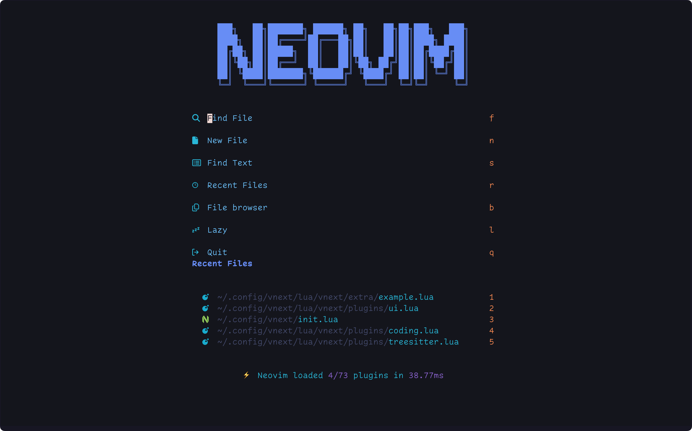
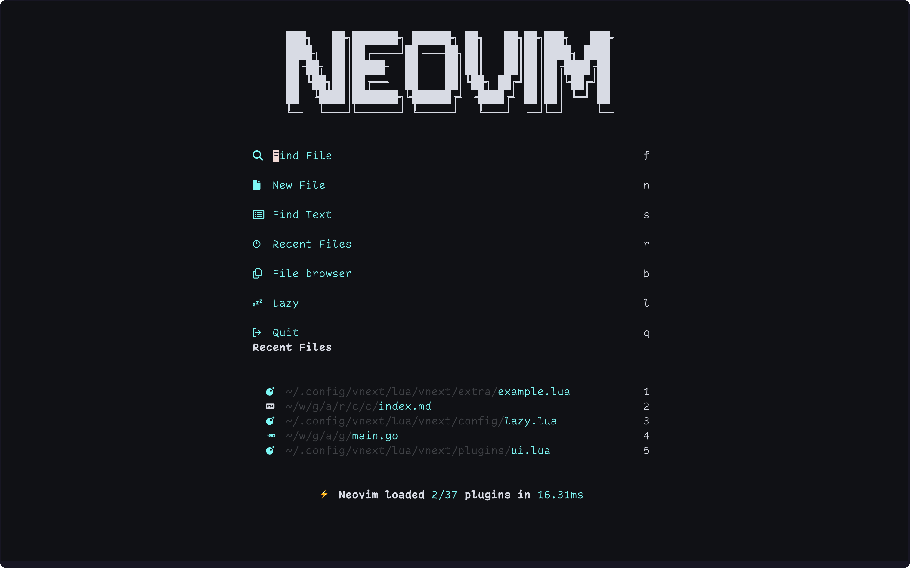
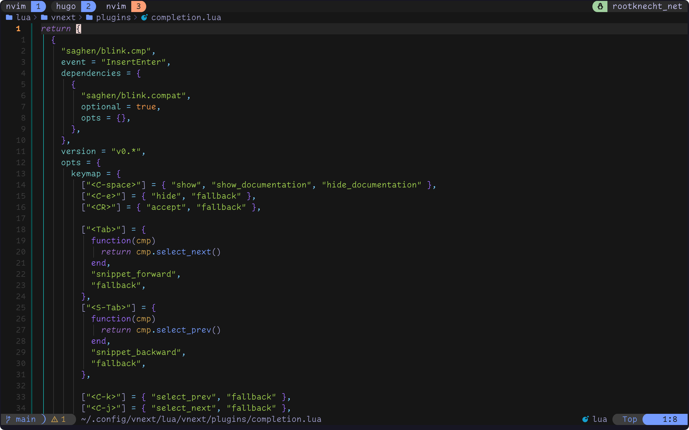
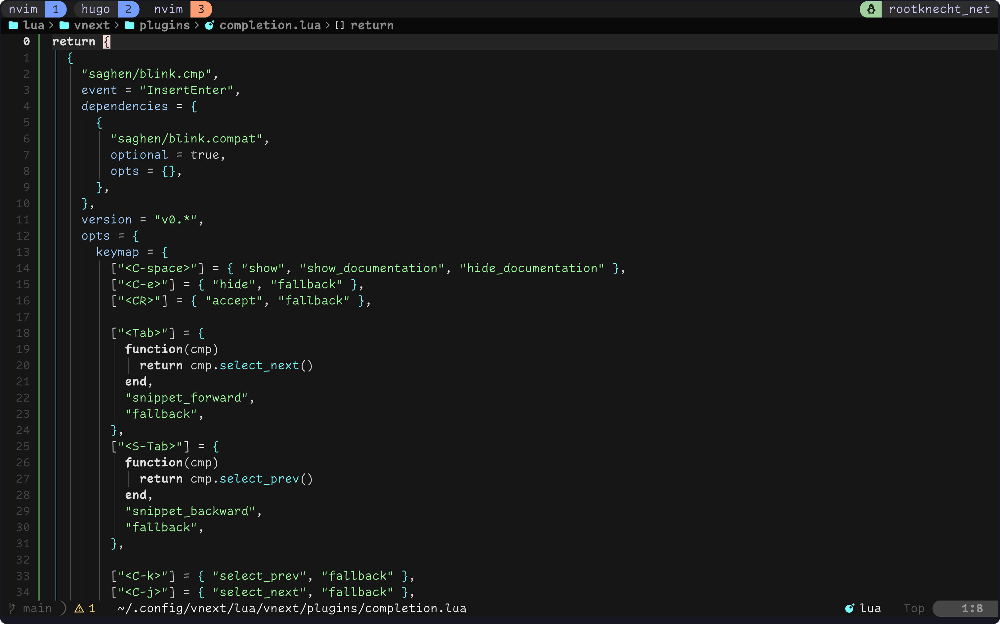


Dieser Beitrag wurde von einer KI ins Deutsche übersetzt. Der englische Originalinhalt wurde von mir verfasst. [Zum englischen Original](https://rootknecht.net/blog/debloating-neovim-config/)


## Was? Neovim und Bloat in einem Satz!?

Ich gebe zu, das klingt etwas seltsam und ist vielleicht etwas Clickbait. Sorry 👼. Aber lassen Sie mich erklären, was ich meine, und beginnen wir mit einigen Statistiken.

Mein Neovim-Konfigurations-Repository wurde im August 2021 erstellt: [^1]

```
❯ curl -s https://api.github.com/repos/Allaman/nvim | jq .created_at
"2021-08-07T11:45:29Z"
```

Seitdem wurden über 1.300 Commits in den Hauptzweig gepusht:

```
❯ git rev-list --count HEAD
1324
```

Im Laufe der Jahre wuchs meine Lua-Codebasis auf über **4000** Zeilen Code an. Neovim wurde mein wichtigstes Werkzeug, und seine Konfiguration wurde mein zeitaufwändigstes Nebenprojekt:

```
❯ tokei
===============================================================================
 Language            Files        Lines         Code     Comments       Blanks
===============================================================================
 Dockerfile              1           20           11            6            3
 Lua                   108         4909         4260          351          298
 Markdown                2          315            0          229           86
 Shell                   2          199          165            9           25
 TOML                    2            9            6            1            2
===============================================================================
 Total                 115         5452         4442          596          414
===============================================================================
```

Das Repository besteht aus 15 Ordnern und 124 Dateien: [^2].

```
❯ tree | tail -n 1
15 directories, 124 files
```

Und schließlich die Kennzahl, auf die alle gewartet haben: Wie viele Plugins verwende ich? Laut [Lazy.nvim](https://github.com/folke/lazy.nvim) sind es derzeit **73** in meiner Konfiguration. Ich muss zugeben, dass diese Zahl bereits gesunken ist, weil ich etwas aufgeräumt habe. Vor nicht allzu langer Zeit lag diese Zahl sehr nahe an 100! Dank Lazy-Loading ist meine Startzeit akzeptabel, aber man will nicht wissen, wie viele Stunden ich damit verbracht habe, Millisekunden zu optimieren 🙊.

```
⚡ Neovim loaded 4/73 plugins in 36.54ms
```



```
blink.cmp
blink.compat
conform.nvim
dressing.nvim
dropbar.nvim
emoji.nvim
flash.nvim
flatten.nvim
friendly-snippets
fzf-lua
gitsigns.nvim
gopher.nvim
gp.nvim
grug-far.nvim
inc-rename.nvim
kustomize.nvim
lazy.nvim
lazydev.nvim
lspkind-nvim
luaSnip
lualine.nvim
markdown-preview.nvim
mason-lspconfig.nvim
mason.nvim
mini.ai
mini.align
mini.icons
mini.surround
mini.test
navigator.nvim
neo-tree.nvim
neoconf.nvim
neogit
noice.nvim
nui.nvim
nvim-autopairs
nvim-dap
nvim-dap-go
nvim-dap-python
nvim-dap-ui
nvim-dap-virtual-text
nvim-highlight-colors
nvim-lint
nvim-lspconfig
nvim-luapad
nvim-nio
nvim-toggleterm.lua
nvim-treesitter
nvim-treesitter-textobjects
nvim-ts-autotag
nvim-ts-hint-textobject
oil.nvim
outline.nvim
overseer.nvim
plenary.nvim
project.nvim
snacks.nvim
substitute.nvim
supermaven-nvim
symbol-usage.nvim
todo-comments.nvim
tokyonight.nvim
treesj
treewalker.nvim
trouble.nvim
ts-advanced-git-search.nvim
typst.vim
vim-fugitive
vim-helm
which-key.nvim
yazi.nvim
```



Außerdem hatte ich die verrückte Idee, meine Konfiguration gewissermaßen „konfigurierbar" zu machen, was mir erlaubt, einige Teile über eine „Benutzer-Konfigurationsdatei" zu überschreiben oder zu erweitern. Dieser Ansatz erhöhte die Komplexität meiner Konfiguration, da ich immer mehr meiner Konfiguration konfigurierbar machte – nicht nur für mich, sondern auch für andere.

Ich würde meine Konfiguration keineswegs als Neovim-Distribution bezeichnen, aber ich arbeitete langsam auf so etwas wie eine halbgare Distribution hin. Es kommt recht oft vor, dass ich beim Ändern einer Konfiguration die Benutzer-Konfigurationsdatei aktualisieren muss (eat your own dog food 😄), die sich in meinem Dotfile-Repository befindet. Nachdem ich mein [Dotfiles-Repo](https://github.com/Allaman/dots) angewendet[^3] habe, wechsle ich zurück zu meiner Neovim-Konfiguration und überprüfe meine Änderungen in der Benutzer-Konfigurationsdatei. Dieser Prozess wurde recht umständlich, je mehr Dinge ich konfigurierbar machte.



```lua
-- https://github.com/Allaman/nvim/
return {
  theme = {
    name = "tokyonight",
    tokyonight = {
      variant = "night",
    },
  },
{{- if eq .chezmoi.os "linux" }}
  lsp_servers = {
    "bashls",
    "dockerls",
    "jsonls",
    "gopls",
    "helm_ls",
    "ltex",
    "marksman",
    "nil_ls",
    "pyright",
    "lua_ls",
    "terraformls",
    "texlab",
    "tflint",
    "ts_ls",
    "tinymist",
    "yamlls",
  },
{{- else }}
  lsp_servers = {
    "bashls",
    "dockerls",
    "jsonls",
    "gopls",
    "helm_ls",
    "ltex",
    "marksman",
    "pyright",
    "lua_ls",
    "terraformls",
    "texlab",
    "tflint",
    "ts_ls",
    "tinymist",
    "yamlls",
  },
{{- end }}
  plugins = {
    blink = {
      enabled = true,
    },
    chatgpt = {
      enable = false,
      opts = {
        api_key_cmd = "gopass show --password openai/api-token",
      },
    },
    copilot = {
      enable = false,
    },
    supermaven = {
      enabled = true,
    },
    emoji = {
      enabled = true,
      opts = {
        enable_cmp_integration = true,
        plugin_path = vim.fn.expand("$HOME/workspace/github.com/allaman/"),
      },
    },
    lf = {
      enable = false,
    },
    git = {
      merge_conflict_tool = "",
    },
    gopher = {
      enable = true,
    },
    gp = {
      enabled = true,
      opts = {
        openai_api_key = { "gopass", "show", "--password", "openai/api-token" },
        providers = {
          openai = {
            disable = false,
          },
          anthropic = {
            disable = false,
            endpoint = "https://api.anthropic.com/v1/messages",
            secret = {"bash", "-c", "cat $HOME/.secrets/anthropic-gp-nvm-token"},
          },
        },
      },
    },
    grug_far = {
      enabled = true,
    },
    harpoon = {
      enabled = false,
    },
    indent_blankline = {
      enable = true,
      enable_scope = false,
    },
    kustomize = {
      dev = true,
      opts = {
        enable_lua_snip = true,
        kinds = {
          show_filepath = true,
          show_line = true,
        },
        run = {
          trivy = {
            cmd = "trivy",
            args = { "-q", "fs" },
          },
          deprecations29 = {
            cmd = "kubent",
            args = { "-t", "1.29", "-c=false", "--helm3=false", "-l=error", "-e", "-f" },
          },
          deprecations30 = {
            cmd = "kubent",
            args = { "-t", "1.30", "-c=false", "--helm3=false", "-l=error", "-e", "-f" },
          },
        },
      },
    },
    lazy = {
      dev = {
        path = "~/workspace/github.com/allaman/",
      },
      disabled_neovim_plugins = {
        "gzip",
        "netrwPlugin",
        "tarPlugin",
        "tohtml",
        "tutor",
        "zipPlugin",
      },
      lockfile = "~/.lazy-lock.json"
    },
    ltex = {
      additional_lang = "de-DE",
    },
    lualine = {
      extensions = { "fugitive", "fzf", "lazy", "neo-tree", "nvim-dap-ui", "quickfix", "symbols-outline", "toggleterm" },
      options = {},
    },
    markdown_preview = {
      enabled = true,
    },
    oil = {
      enabled = true,
    },
    overseer = {
      enable = true,
    },
    substitute = {
      enabled = true,
    },
    symbol_usage = {
      opts = {
        vt_position = "end_of_line",
        disable = { filetypes = {"dockerfile"} },
      },
    },
    telescope = {
      show_untracked_files = true,
      fzf_native = true,
    },
    todo_comments = {
      enabled = true,
    },
    trouble = {
      enabled = true,
    },
    zenmode = {
      enable = true,
    },
    yazi = {
      enabled = true,
    },
  }
}
```



Ich denke, die Idee ist klar. Meine Konfiguration wurde zu einem [Big Ball of Mud](https://en.wikipedia.org/wiki/Anti-pattern#Software_engineering_anti-patterns) 🤣. Außerdem bedeuten viele Plugins häufige (und manchmal brechende) Updates, die noch mehr Zeit in Anspruch nehmen. Und schließlich bin ich nicht [Folke](https://github.com/folke) oder ein anderer Neovim-Distributions-Maintainer. Die Implementierung einer Benutzer-Konfiguration war zu ehrgeizig.

## Ein neuer Anfang

Aufgrund der Komplexität meiner Konfiguration entschied ich, dass es nicht lohnenswert war, sie zu refaktorieren, sondern von Grund auf neu zu beginnen. Warum nicht eine der großartigen Neovim-Distributionen verwenden? Ich spielte mit [LazyVim](https://github.com/LazyVim/LazyVim), und ehrlich gesagt würde es 90 % meiner Anwendungsfälle abdecken. Das Problem liegt in den letzten 10 %, auf die ich nicht verzichten kann. Außerdem ist LazyVim ein recht großes (über 11.000 Zeilen Code) und ausgefeiltes Projekt, und das Verstehen seines Codes braucht Zeit. Ich habe keine anderen Distributionen getestet, aber ich stelle mir vor, die Ergebnisse wären ähnlich.

### Ziele meiner neuen Konfiguration

- Plugins: So viele wie nötig, aber so wenige wie möglich. Ich hatte Plugins, die ich kaum je benutzte, nur für den Fall, dass ich sie brauchen würde.
- Codezeilen reduzieren und mehr Kommentare hinzufügen. Ehrlich gesagt verstehe ich einige Teile meiner alten Konfiguration ohne tiefes Eintauchen nicht mehr.
- Die Konfiguration nur für mich selbst schreiben.
- Nicht versuchen, alles in Ema… Neovim zu erledigen 😜.
- Eine sehr schnelle und knackige Benutzererfahrung sicherstellen. Ja, ich spüre den Unterschied zwischen einer 20-ms- und einer 50-ms-Startzeit.

### Mehrere Konfigurationen gleichzeitig betreiben

Ich brauche Neovim zum Arbeiten, also ist stundenlanges Herumspielen mit seiner Konfiguration keine Option. Glücklicherweise gibt es eine Möglichkeit, mehrere Neovim-Konfigurationen gleichzeitig zu betreiben:

```sh
mkdir $HOME/.config/vnext
export vv="NVIM_APPNAME=vnext nvim" \
```

Das ist alles. Wenn ich `vv` aufrufe, lande ich in einer frischen Neovim-Instanz, bereit für meine Konfigurationsreise, während mein „Standard"-Neovim in `$HOME/.config/nvim/` mit dem Alias `v` verfügbar bleibt. Natürlich könnte `NVIM_APPNAME` mehrmals gesetzt werden, um verschiedene Neovim-Distributionen zusätzlich zur eigenen Konfiguration auszuprobieren.

Ich entschied mich, meine neue Konfiguration von Anfang an als täglichen Treiber zu nutzen und sie iterativ zu erweitern, wann immer mir eine Funktion fehlte. Da ich an verschiedenen Projekten und Technologien arbeite, erstreckte sich dieser Prozess über mehrere Wochen.

## Meine neue Konfiguration

Ich habe nicht wirklich von Grund auf neu begonnen, sondern [kickstart.nvim](https://github.com/nvim-lua/kickstart.nvim/blob/master/init.lua) eine Chance gegeben. Ich begann mit seiner `init.lua` und teilte sie nach meinen Vorlieben in Teile auf. Insbesondere die LSP-Konfiguration ist viel sauberer als mein früheres Durcheinander.

Ich entfernte alle Optionen und fügte sie schrittweise wieder hinzu, wenn ich fehlende Funktionalität bemerkte. Ich kopierte auch meine unverzichtbaren Plugins aus meiner alten Konfiguration, entfernte die Benutzer-Konfiguration und räumte auf.

### Verzeichnisstruktur

Von dort aus entschied ich mich, bei meinem bisherigen Ordner-Layout zu bleiben, vermied aber das Erstellen einer Datei für jedes Plugin[^4].

Meine aktuelle Struktur:

```
├── lua
│   └── vnext
│       ├── config
│       │   ├── autocmds.lua
│       │   ├── init.lua
│       │   ├── lazy.lua
│       │   ├── mappings.lua
│       │   └── options.lua
│       ├── extra # Überraschung 🤣
│       ├── init.lua
│       └── plugins
│           ├── coding.lua
│           ├── completion.lua
│           ├── editing.lua
│           ├── fzf-lua.lua
│           ├── git.lua
│           ├── lsp.lua
│           ├── navigator.lua
│           ├── neo-tree.lua
│           ├── snacks.lua
│           ├── snippets.lua
│           ├── statusline.lua
│           ├── treesitter.lua
│           ├── ui.lua
│           └── which-key.lua
```

### Einige meiner Entscheidungen

1. **Beim Standard-Theme bleiben.** Neovims [Standard-Theme](https://github.com/neovim/neovim/pull/26334) wurde von niemand Geringerem als [echasnovski](https://github.com/echasnovski), dem Autor der [mini.nvim](https://github.com/echasnovski)-Suite, aktualisiert. Meiner Meinung nach hat er gute Arbeit geleistet, und es „erledigt die Arbeit". Spaßfakt: Ein Theme fügt laut Lazy 4 oder 5 ms hinzu.

2. **Kein DAP.** Ich arbeite als DevOps/Cloud-Engineer, und meine Arbeit besteht hauptsächlich aus HCL, YAML und Bash. Außerdem arbeite ich an relativ kleinen Go- und Python-Projekten, bei denen ich selten Debugging brauche – meist nur um zu bestätigen, dass meine Cloud-Ressourcen korrekt eingerichtet sind 🤣.

3. **Kein AI.** Ich installierte mehrere AI-Plugins ([ChatGPT.nvim](https://github.com/jackMort/ChatGPT.nvim), [gp.nvim](https://github.com/Robitx/gp.nvim), [copilot.lua](https://github.com/zbirenbaum/copilot.lua), [supermave-nvim](https://github.com/supermaven-inc/supermaven-nvim)), aber ich benutzte sie kaum. Ehrlich gesagt ist AI kein wesentlicher Teil meines Workflows. Vielleicht bin ich ein Boomer ...

4. **[Luasnip](https://github.com/L3MON4D3/LuaSnip) statt der eingebauten [Snippet-API](https://github.com/neovim/neovim/pull/25301).** Der Migrationspfad war mir nicht klar, und ich wollte keine weitere Zeit damit verbringen. Außerdem ist Luasnip leistungsfähiger.

5. **Nur meine eigene Umgebung berücksichtigen.** Zum Beispiel läuft Tmux immer, also brauche ich kein Neovim-Terminal-Plugin – ich kann einfach einen Tmux-Pane aufteilen.

### Extra-Ordner

Wahrscheinlich haben Sie den `extra`-Ordner in meiner Konfiguration bemerkt. Nun, ich konnte nicht widerstehen. Wer meine Konfiguration forken oder nutzen möchte und mit einigen meiner Entscheidungen leben kann, findet hier den Platz für Anpassungen. Dieser Ordner wird mit den LazySpecs im `plugins`-Ordner zusammengeführt, sodass eigene Plugins hinzugefügt, Plugins deaktiviert oder Plugin-Optionen überschrieben werden können. Um zum Beispiel dropbar zu deaktivieren, einfach folgendes hinzufügen:

```lua
return {
  {
    "Bekaboo/dropbar.nvim",
    enabled = false,
  },
}
```

### Das Ergebnis

 [^5]

Meine Plugin-Liste wurde auf **37** reduziert. Meine Codebasis umfasst jetzt ca. **1.330** Zeilen – nur ein Drittel meiner früheren Konfiguration. Ich habe die Startzeit auf unter **20 ms** gesenkt, eine Reduktion um 20 ms, was spürbar schneller ist.


blink.cmp
blink.compat
conform.nvim
dropbar.nvim
emoji.nvim
fidget.nvim
flash.nvim
friendly-snippets
fzf-lua
gitsigns.nvim
grug-far.nvim
kustomize.nvim
lazydev.nvim
luaSnip
lualine.nvim
mason-lspconfig.nvim
mason-tool-installer.nvim
mason.nvim
mini.icons
mini.surround
navigator.nvim
neo-tree.nvim
noice.nvim
nui.nvim
nvim-autopairs
nvim-colorizer.lua
nvim-lint
nvim-lspconfig
nvim-treesitter
outline.nvim
plenary.nvim
snacks.nvim
substitute.nvim
todo-comments.nvim
which-key.nvim
yazi.nvim










## Fazit

Ich war mit meiner Neovim-Konfiguration seit einiger Zeit unzufrieden, aus den zuvor genannten Gründen. Das Hauptproblem war, dass sie übermäßig komplex geworden war und es keinen Spaß mehr machte, sie zu pflegen. Außerdem hatte ich das Gefühl, zu viel in Neovim hineinzustopfen.

Obwohl das wachsende Ökosystem seit Neovim 0.5 zweifellos großartig ist, möchte ich nicht, dass Neovim alles tut. Wir haben bereits ausgezeichnete, dedizierte Tools direkt in unseren Shells. Das gesagt, Optionen zu haben ist fantastisch, und mit dem Hinzufügen eines [Window Managers](https://github.com/altermo/nwm) für Neovim haben wir wohl endlich zu Emacs aufgeholt 😎.

Ich bin jetzt vollkommen zufrieden mit meiner verschlankten Konfiguration und den kleinen Kompromissen, die ich eingegangen bin. Mal sehen, wann der nächste Folgebeitrag erscheint 🤣.

[^1]: Ich kann meinen ursprünglichen [vimrc](https://github.com/Allaman/dotfiles/blob/master/vimrc) bis März 2020 zurückverfolgen 🤓.

[^2]: Diese Messung ist nicht 100 % genau, aber fast.

[^3]: Meine Dotfiles werden von [chezmoi](https://github.com/twpayne/chezmoi) verwaltet. Alle Änderungen an Dotfiles müssen durch Ausführen von `chezmoi apply` angewendet werden.

[^4]: Das bedeutet über 70 Dateien und auf dem Höhepunkt fast 100 Dateien für Plugins!

[^5]: Die alte Konfiguration ist noch im `v1`-Branch zu finden.
