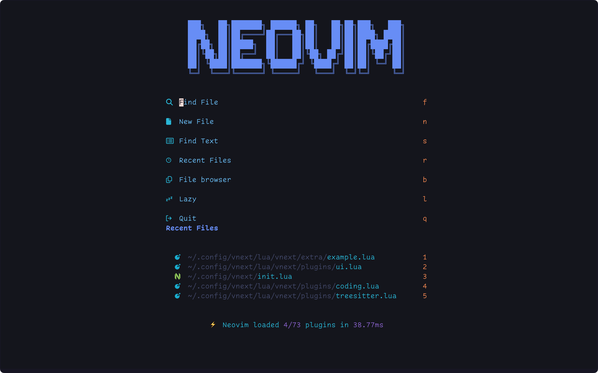
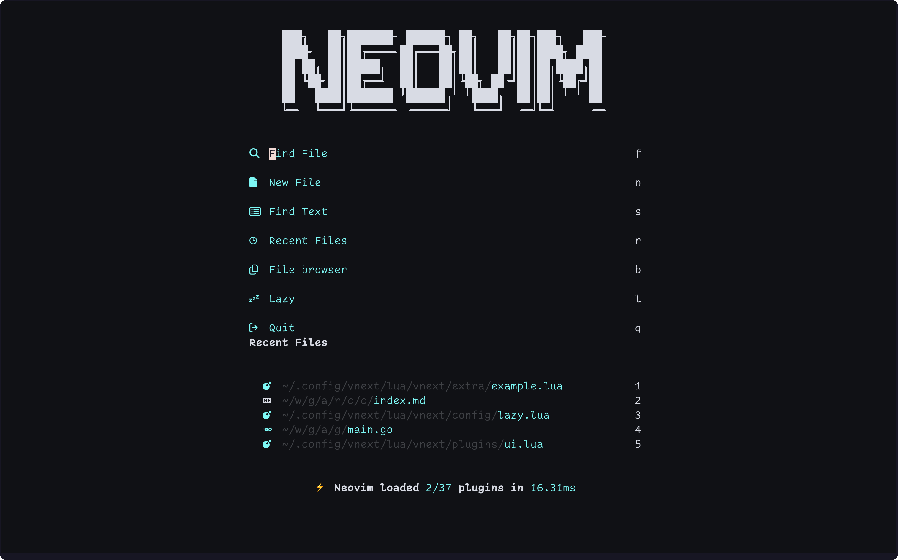
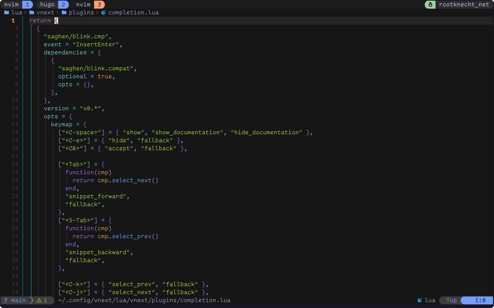
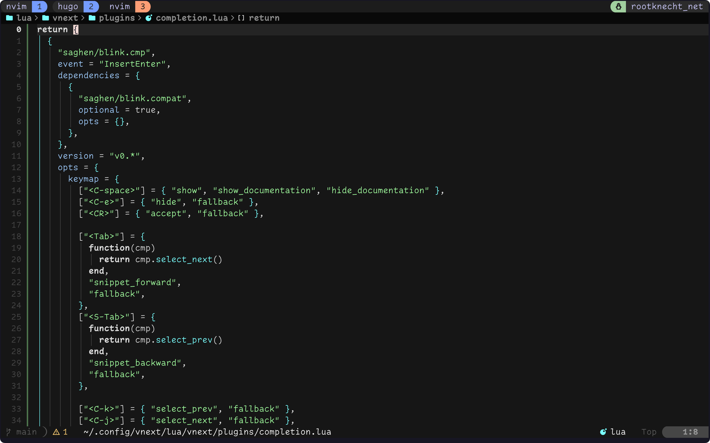

## What? Neovim and bloat in one sentence!?

I admit, this statement is a little odd and maybe a little clickbait. Sorry 👼. But let me explain what I mean and begin with some statistics.

My Neovim configuration repository was created in August 2021: [^1]

```
❯ curl -s https://api.github.com/repos/Allaman/nvim | jq .created_at
"2021-08-07T11:45:29Z"
```

Since then, over 1,300 commits have been pushed to the main branch:

```
❯ git rev-list --count HEAD
1324
```

Over the last few years, my Lua codebase grew to over **4000** lines of code. Neovim became my most important tool, and its configuration became my most time-consuming side project:

```
❯ tokei
===============================================================================
 Language            Files        Lines         Code     Comments       Blanks
===============================================================================
 Dockerfile              1           20           11            6            3
 Lua                   108         4909         4260          351          298
 Markdown                2          315            0          229           86
 Shell                   2          199          165            9           25
 TOML                    2            9            6            1            2
===============================================================================
 Total                 115         5452         4442          596          414
===============================================================================
```

The repository consists of 15 folders and 124 files: [^2].

```
❯ tree | tail -n 1
15 directories, 124 files
```

And finally, the metric you’ve all been waiting for: how many plugins do I use? According to [Lazy.nvim](https://github.com/folke/lazy.nvim), there are currently **73** in my configuration. I must admit this number has already decreased because I did some cleanup. Not long ago, this number was very close to 100! Thanks to lazy-loading, my startup time is acceptable, but you don’t want to know how many hours I’ve spent tweaking milliseconds 🙊.

```
⚡ Neovim loaded 4/73 plugins in 36.54ms
```



```
blink.cmp
blink.compat
conform.nvim
dressing.nvim
dropbar.nvim
emoji.nvim
flash.nvim
flatten.nvim
friendly-snippets
fzf-lua
gitsigns.nvim
gopher.nvim
gp.nvim
grug-far.nvim
inc-rename.nvim
kustomize.nvim
lazy.nvim
lazydev.nvim
lspkind-nvim
luaSnip
lualine.nvim
markdown-preview.nvim
mason-lspconfig.nvim
mason.nvim
mini.ai
mini.align
mini.icons
mini.surround
mini.test
navigator.nvim
neo-tree.nvim
neoconf.nvim
neogit
noice.nvim
nui.nvim
nvim-autopairs
nvim-dap
nvim-dap-go
nvim-dap-python
nvim-dap-ui
nvim-dap-virtual-text
nvim-highlight-colors
nvim-lint
nvim-lspconfig
nvim-luapad
nvim-nio
nvim-toggleterm.lua
nvim-treesitter
nvim-treesitter-textobjects
nvim-ts-autotag
nvim-ts-hint-textobject
oil.nvim
outline.nvim
overseer.nvim
plenary.nvim
project.nvim
snacks.nvim
substitute.nvim
supermaven-nvim
symbol-usage.nvim
todo-comments.nvim
tokyonight.nvim
treesj
treewalker.nvim
trouble.nvim
ts-advanced-git-search.nvim
typst.vim
vim-fugitive
vim-helm
which-key.nvim
yazi.nvim
```



Additionally, I came up with the crazy idea of making my config sort of "configurable," allowing me to overwrite or extend some parts of my configuration through a “user config file.” This approach added more complexity to my configuration as I kept making more and more of my config configurable — not just for myself but for others, too.

By no means would I call my config a Neovim distribution, but I was slowly working toward something like a half-baked distribution. It happens quite often that when I want to change some configuration, I must update the user config file (eat your own dog food 😄), which is in my dotfile repository. After applying[^3] my [dotfiles repo](https://github.com/Allaman/dots), I move back to my Neovim configuration and check my changes in the user config file. This process became quite cumbersome as I made more and more things configurable.



```lua
-- https://github.com/Allaman/nvim/
return {
  theme = {
    name = "tokyonight",
    tokyonight = {
      variant = "night",
    },
  },
{{- if eq .chezmoi.os "linux" }}
  lsp_servers = {
    "bashls",
    "dockerls",
    "jsonls",
    "gopls",
    "helm_ls",
    "ltex",
    "marksman",
    "nil_ls",
    "pyright",
    "lua_ls",
    "terraformls",
    "texlab",
    "tflint",
    "ts_ls",
    "tinymist",
    "yamlls",
  },
{{- else }}
  lsp_servers = {
    "bashls",
    "dockerls",
    "jsonls",
    "gopls",
    "helm_ls",
    "ltex",
    "marksman",
    "pyright",
    "lua_ls",
    "terraformls",
    "texlab",
    "tflint",
    "ts_ls",
    "tinymist",
    "yamlls",
  },
{{- end }}
  plugins = {
    blink = {
      enabled = true,
    },
    chatgpt = {
      enable = false,
      opts = {
        api_key_cmd = "gopass show --password openai/api-token",
      },
    },
    copilot = {
      enable = false,
    },
    supermaven = {
      enabled = true,
    },
    emoji = {
      enabled = true,
      opts = {
        enable_cmp_integration = true,
        plugin_path = vim.fn.expand("$HOME/workspace/github.com/allaman/"),
      },
    },
    lf = {
      enable = false,
    },
    git = {
      merge_conflict_tool = "",
    },
    gopher = {
      enable = true,
    },
    gp = {
      enabled = true,
      opts = {
        openai_api_key = { "gopass", "show", "--password", "openai/api-token" },
        providers = {
          openai = {
            disable = false,
          },
          anthropic = {
            disable = false,
            endpoint = "https://api.anthropic.com/v1/messages",
            secret = {"bash", "-c", "cat $HOME/.secrets/anthropic-gp-nvm-token"},
          },
        },
      },
    },
    grug_far = {
      enabled = true,
    },
    harpoon = {
      enabled = false,
    },
    indent_blankline = {
      enable = true,
      enable_scope = false,
    },
    kustomize = {
      dev = true,
      opts = {
        enable_lua_snip = true,
        kinds = {
          show_filepath = true,
          show_line = true,
        },
        run = {
          trivy = {
            cmd = "trivy",
            args = { "-q", "fs" },
          },
          deprecations29 = {
            cmd = "kubent",
            args = { "-t", "1.29", "-c=false", "--helm3=false", "-l=error", "-e", "-f" },
          },
          deprecations30 = {
            cmd = "kubent",
            args = { "-t", "1.30", "-c=false", "--helm3=false", "-l=error", "-e", "-f" },
          },
        },
      },
    },
    lazy = {
      dev = {
        path = "~/workspace/github.com/allaman/",
      },
      disabled_neovim_plugins = {
        "gzip",
        "netrwPlugin",
        "tarPlugin",
        "tohtml",
        "tutor",
        "zipPlugin",
      },
      lockfile = "~/.lazy-lock.json"
    },
    ltex = {
      additional_lang = "de-DE",
    },
    lualine = {
      extensions = { "fugitive", "fzf", "lazy", "neo-tree", "nvim-dap-ui", "quickfix", "symbols-outline", "toggleterm" },
      options = {},
    },
    markdown_preview = {
      enabled = true,
    },
    oil = {
      enabled = true,
    },
    overseer = {
      enable = true,
    },
    substitute = {
      enabled = true,
    },
    symbol_usage = {
      opts = {
        vt_position = "end_of_line",
        disable = { filetypes = {"dockerfile"} },
      },
    },
    telescope = {
      show_untracked_files = true,
      fzf_native = true,
    },
    todo_comments = {
      enabled = true,
    },
    trouble = {
      enabled = true,
    },
    zenmode = {
      enable = true,
    },
    yazi = {
      enabled = true,
    },
  }
}
```



I think you get the idea. My config became a [big ball of mud](https://en.wikipedia.org/wiki/Anti-pattern#Software_engineering_anti-patterns) 🤣. Additionally, many plugins mean frequent (and sometimes breaking) updates, which take up even more time. Last but not least, I am not [Folke](https://github.com/folke) or any other Neovim distribution maintainer. Implementing a user config was too ambitious.

## A new beginning

Due to the complexity of my config, I decided it wasn’t worth refactoring but instead to start from scratch. Why not just use one of the awesome Neovim distributions out there? I played with [LazVim](https://github.com/LazyVim/LazyVim), and to be honest, it would cover 90% of my use cases. The problem lies in the last 10% that I can’t compromise on. Additionally, LazyVim is a rather large (over 11,000 lines of code) and sophisticated project, and understanding its code takes time. I haven’t tested other distributions, but I imagine the results would be similar.

### Goals of my new config

- Plugins: Use as many as necessary, but as few as possible. I had plugins I barely ever used, just for the sake of “what if I need that?”
- Reduce lines of code and add more comments. To be honest, I don’t even understand some parts of my old config without a deep dive.
- Write the config just for myself.
- Don’t try to do everything in Ema… Neovim 😜.
- Ensure a very fast and snappy user experience. Yes, I can feel the difference between a 20ms and a 50ms startup time.

### Running multiple configs

I need Neovim to work, so tinkering with its config for days and weeks is not an option. Fortunately, there’s a way to run multiple Neovim configurations at the same time:

```sh
mkdir $HOME/.config/vnext
export vv="NVIM_APPNAME=vnext nvim" \
```

That’s it. When I call `vv`, I drop into a fresh Neovim instance, ready for my configuration journey, while keeping my “default” Neovim in `$HOME/.config/nvim/` when running my alias `v`. Of course, you could set NVIM_APPNAME multiple times and try various Neovim distributions in addition to your own configuration.

I decided to use my new config right from the start as my daily driver and iterate on it whenever I missed a feature. As I work on various projects and technologies, this process spanned several weeks.

## My new config

I didn’t start entirely from scratch but gave [kickstart.nvim](https://github.com/nvim-lua/kickstart.nvim/blob/master/init.lua) a shot. I began with its `init.lua` and split it into parts to suit my preferences. Notably, the LSP config is much cleaner compared to my former mess.

I removed all options and gradually added them back as I noticed missing functionality. I also copied my must-have plugins from my old config, removed user configuration, and cleaned things up.

### Directory structure

From there, I decided to stick to my former folder layout but avoided creating a file for each plugin[^4].

My current structure:

```
├── lua
│   └── vnext
│       ├── config
│       │   ├── autocmds.lua
│       │   ├── init.lua
│       │   ├── lazy.lua
│       │   ├── mappings.lua
│       │   └── options.lua
│       ├── extra # surprise 🤣
│       ├── init.lua
│       └── plugins
│           ├── coding.lua
│           ├── completion.lua
│           ├── editing.lua
│           ├── fzf-lua.lua
│           ├── git.lua
│           ├── lsp.lua
│           ├── navigator.lua
│           ├── neo-tree.lua
│           ├── snacks.lua
│           ├── snippets.lua
│           ├── statusline.lua
│           ├── treesitter.lua
│           ├── ui.lua
│           └── which-key.lua
```

### Some decisions I made

1. **Stick to the default theme.** Neovim's [default theme](https://github.com/neovim/neovim/pull/26334) was updated by no other than [echasnovski](https://github.com/echasnovski), the author of the [mini.nvim](https://github.com/echasnovski) suite. In my opinion he did a great job and it gets "the job done". Fun fact: A theme adds according to Lazy 4 or 5 ms.

2. **No DAP.** I work as a DevOps/Cloud Engineer, and my work primarily involves dealing with HCL, YAML, and Bash. Additionally, I work with relatively small Go and Python projects where I rarely need debugging — mostly just to confirm that my cloud resources are set up properly 🤣.

3. **No AI.** I installed several AI plugins ([ChatGPT.nvim](https://github.com/jackMort/ChatGPT.nvim), [gp.nvim](https://github.com/Robitx/gp.nvim), [copilot.lua](https://github.com/zbirenbaum/copilot.lua), [supermave-nvim](https://github.com/supermaven-inc/supermaven-nvim)) but I barely ever touched them. To be honest, AI is not a major part of my workflow. Maybe I am a boomer ...

4. **[Luasnip](https://github.com/L3MON4D3/LuaSnip) instead of the built-in [snippet API](https://github.com/neovim/neovim/pull/25301).** The migration path was not clear to me and I didn't want to spent more time. In addition, Luasnip is more powerful.

5. **Only account for my environment.** For instance, Tmux is always running, so there’s no need for a Neovim terminal plugin — I can simply split a Tmux pane instead.

### Extra folder

You’ve probably noticed the `extra` folder in my config. Well, I couldn’t resist. If someone out there wants to fork or use my config and can live with some of my decisions, this is the place for customizations. This folder is merged with the LazySpecs in the `plugins` folder, allowing you to add your own plugins, disable plugins, or overwrite plugin options. For example, to disable dropbar, simply add:

```lua
return {
  {
    "Bekaboo/dropbar.nvim",
    enabled = false,
  },
}
```

### The result

 [^5]

My list of plugins has been reduced to **37**. My codebase is now approximately **1,330** lines — just one-third of my former configuration. I managed to bring my startup time down to under **20ms**, a reduction of 20ms, which is noticeably faster.


blink.cmp
blink.compat
conform.nvim
dropbar.nvim
emoji.nvim
fidget.nvim
flash.nvim
friendly-snippets
fzf-lua
gitsigns.nvim
grug-far.nvim
kustomize.nvim
lazydev.nvim
luaSnip
lualine.nvim
mason-lspconfig.nvim
mason-tool-installer.nvim
mason.nvim
mini.icons
mini.surround
navigator.nvim
neo-tree.nvim
noice.nvim
nui.nvim
nvim-autopairs
nvim-colorizer.lua
nvim-lint
nvim-lspconfig
nvim-treesitter
outline.nvim
plenary.nvim
snacks.nvim
substitute.nvim
todo-comments.nvim
which-key.nvim
yazi.nvim










## Verdict

I had been unhappy with my Neovim configuration for quite some time due to the reasons mentioned earlier in this post. The main issue was that my config had become overly complex and no longer enjoyable to maintain. Additionally, I felt like I was trying to cram too much into Neovim.

While the growing ecosystem since Neovim 0.5 is undeniably awesome, I don’t want Neovim to do everything. We already have excellent, dedicated tools available right in our shells. That said, having options is fantastic, and with the addition of a [window manager](https://github.com/altermo/nwm) for Neovim, I guess we’ve finally caught up to Emacs 😎.

I’m now completely satisfied with my slimmed-down configuration and the minor trade-offs I made. Let’s see when a follow-up post happens 🤣.

[^1]: I can track back my OG [vimrc](https://github.com/Allaman/dotfiles/blob/master/vimrc) to March 2020 🤓.

[^2]: This measurement is not 100% accurate but almost.

[^3]: My dotfiles are managed by [chezmoi](https://github.com/twpayne/chezmoi). Any changes to dotfiles must be applied by running `chezmoi apply`.

[^4]: That means over 70 files and at the peack nearly 100 files for plugins!

[^5]: You can still find my old config in the `v1` branch.
