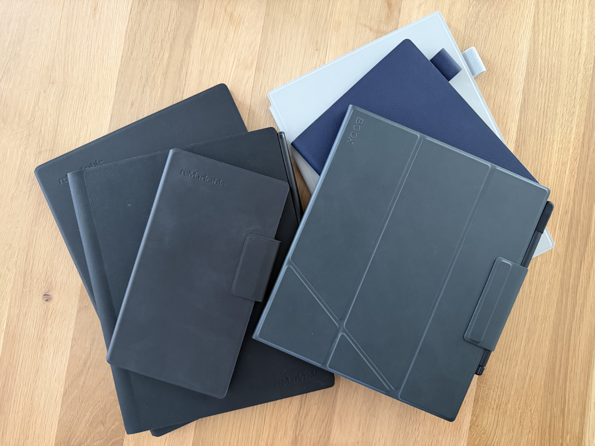


Dieser Beitrag wurde von einer KI ins Deutsche übersetzt. Der englische Originalinhalt wurde von mir verfasst. [Zum englischen Original](https://rootknecht.net/blog/eink-note-taking-onyx-boox-remarkable-supernote/)


## Einleitung

Ich nutze E-Ink-Notizgeräte seit Jahren und besaß Modelle mehrerer großer Marken[^1], darunter Onyx Boox, Remarkable und Supernote. Nach langem Alltageinsatz und dem Vergleich ihrer Stärken und Schwächen entschloss ich mich 2026, mich endgültig für die beste E-Ink-Notizplattform für meinen Workflow zu entscheiden.

> [!NOTE]
> Ich bin weder gesponsert noch in irgendeiner Weise mit diesen Unternehmen verbunden.

> [!INFO]
> Dieser Beitrag soll keine umfassende Rezension sein, sondern meine persönliche Meinung widerspiegeln. Für umfassende Rezensionen empfehle ich [My Deep Guide](https://www.youtube.com/MyDeepGuide) (YouTube) und [Chalid Raqami](https://www.youtube.com/@ChalidRaqami) (YouTube).

## Onyx Boox Note Air 3 C

Ehrlich gesagt liegt mein einziges Boox-Gerät schon eine Weile unbenutzt herum. Die Hardware ist wunderschön, und die Möglichkeiten sind fast vergleichbar mit einem „echten" Tablet (abzüglich Medien und Spiele).

### Vorteile

- Es ist hochgradig anpassbar und läuft mit einem vollständigen Android-Betriebssystem, inklusive Play Store direkt nach dem Auspacken, mit vielen Konfigurationsoptionen für die Reader- und Writer-Apps.
- Kein Flackern trotz Farbe (Kaleido 3).
- Es gibt viele (physische) Stift-Auswahlmöglichkeiten für die zugrunde liegende EMR-Technologie.

### Nachteile

- Viele Optionen, viele Knöpfe und verschachtelte Menüs führen zu kognitiver Überlastung.
- Es gibt Datenschutzbedenken[^2], und einige Lösungen (NetGuard, WebDAV / Syncthing) machen das Gerät weniger angenehm zu bedienen und sind nicht jedermanns Sache.
- Das Betriebssystem fühlt sich nicht sehr zuverlässig an; ich erlebte einige Abstürze.

## Remarkable (als Plattform)

Einige Vor- und Nachteile, die für jedes Remarkable-Gerät zutreffen.

### Vorteile

- Geräte basieren auf Linux und sind von Haus aus sehr entwicklerfreundlich (hackbar).[^3]
- Remarkable bietet eine der besten Cloud-/Sync-Erfahrungen.
- Eine solide mobile App.

### Nachteile

- Für den Zugang zu allen Funktionen ist ein Abonnement erforderlich.
- Für die beste Erfahrung muss man Remarkables Cloud-Angebot vertrauen. Es gibt Umgehungslösungen, die aber nicht komfortabel sind, weshalb das Gerät wahrscheinlich seltener genutzt wird.

## Remarkable 2

Mein erstes E-Ink-Notizgerät, das ich gebraucht kaufte, weil ich unsicher war, insbesondere angesichts des hohen Preises. Ich denke, es ist immer noch ein gutes Gerät, aber man merkt sein Alter.

### Vorteile

- Es gibt viele Stift-Auswahlmöglichkeiten, da die zugrunde liegende Technologie EMR ist (wie beim Onyx Boox Note Air 3 C).
- Kein Flackern und minimales Geistern.

### Nachteile

- Kein Hintergrundlicht.
- Die Leseerfahrung ist nur mittelmäßig. EPUBs werden auf dem Gerät in PDFs konvertiert, was das EPUB-Lesen umständlich macht. PDFs sind in Ordnung.

## Remarkable Paper Pro

Farbe und Hintergrundlicht! Ein großer Schritt nach vorne für Remarkable, aber auch mit seinen Eigenheiten.

### Vorteile

- Es gibt eine große Auswahl an (Software-)Stiften, die sehr gut implementiert sind.
- Die UI (Schaltflächen, Menüs) reagiert sehr schnell.

### Nachteile

- Zoomen ist mühsam, besonders bei farbigen Inhalten.
- Unangenehm zu halten. Es ist groß und schwer und eher ein Schreibtischgerät.
- Es gibt viel Flackern, besonders mit Farbe.

## Remarkable Paper Pro Move

Ein tragbares E-Ink-Gerät im Formfaktor eines Traveler's Notebooks.

### Vorteile

- Einhändige Benutzung ist komfortabel.
- Die Rückseite wirkt robuster und ist weniger kratzempfindlich als beim Paper Pro.

### Nachteile

- Die Skalierung zwischen Paper Pro und Move ist unbequem. Entweder ist der Inhalt zu klein (Paper Pro → Move) oder hat weiße Ränder (Move → Paper Pro).
- Man muss sich an die hohen Maße gewöhnen – nicht so sehr beim Tragen, aber beim Schreiben.

## Supernote A5X2 Manta

Keine Farbe, kein Hintergrundlicht. Eindeutig unterlegen im Lineup – oder doch nicht?

### Vorteile

- Bietet das beste Stift-Haptik. Der Metal Pen 2, Lamy Safari Vista EMR und Push-Up Standard Pen fühlen sich alle sehr premium und eigenständig an.
- Bietet das beste Schreibgefühl für mich im Vergleich zu Remarkable- und Onyx Boox-Geräten. Es fühlt sich nicht kratzig und sehr weich an und wird oft mit einem Kugelschreiber verglichen, im Vergleich zu einem Bleistift (Remarkable, Boox).
- Bietet eine angenehme Benutzeroberfläche, die Funktionen und Unübersichtlichkeit ausbalanciert.
- Gute Konnektivitätsfunktionen. Bemerkenswert: einen Webserver starten, um über einen Browser auf Dateien zuzugreifen, oder Ordner zum Synchronisieren auswählen, wenn man nicht alle Daten synchronisieren möchte.
- Und die Killer-Funktion für mich: Private Cloud! Kein Rätseln mehr, ob ich diese Daten auf einem fremden Server ablegen kann. Jetzt liegt alles auf meiner Infrastruktur.

### Nachteile

- Wirkt manchmal nicht so reaktionsschnell wie Remarkable, besonders beim Wechsel zwischen Stift und Radierer.
- Kein Hintergrundlicht.
- Die Synchronisation ist nicht so ausgereift[^4] wie bei Remarkable, aber sie erfüllt ihren Zweck.

## Supernote A6X2 Nomad

Das Pendant zum Remarkable Paper Pro Move, das noch einhändig gehalten werden kann. Grundsätzlich gibt es kaum einen Unterschied zwischen den Geräten, was ich mag. Es ist einfach eine portablere Version des Manta mit einer „vollständigen" Abdeckung und fühlt sich daher schwerer an als der größere Manta. Ich benutze den Manta zum Lesen technischer Dokumente und Skizzieren von Ideen, und den Nomad für Notizen, Tagesplanung, Einkaufslisten usw.

## Fazit

Nach dem Vergleich von Onyx Boox, Remarkable und Supernote entschied ich mich letztendlich für Supernote als beste E-Ink-Notizplattform für meine Bedürfnisse.
Sowohl das Supernote A5X2 Manta als auch das A6X2 Nomad bieten die beste Balance zwischen fokussiertem Schreiben, durchdachten Softwarefunktionen und einem ablenkungsfreien Erlebnis.

Das Schreibgefühl ist für mich Remarkable und Boox gegenüber überlegen, und die Hinzufügung einer privaten Cloud[^5] – immer noch einzigartig unter den großen E-Ink-Herstellern – war der endgültige ausschlaggebende Faktor.
Sie gibt mir die volle Kontrolle über meine Notizen, ohne auf Cloud-Dienste Dritter angewiesen zu sein.

Ich glaubte früher, dass Farb-E-Ink Schwarz-Weiß-Geräte obsolet machen würde. Nach langem Einsatz habe ich das Gegenteil gelernt: Für ernsthaftes Notieren liefert monochromes E-Ink immer noch die beste Erfahrung.

Wenn Sie sich zwischen Supernote, Remarkable und Onyx Boox entscheiden, hoffe ich, dass dieser Vergleich Ihnen hilft, das richtige E-Ink-Notizgerät für Ihren Workflow zu wählen.

[^1]: Dieser Blogbeitrag konzentriert sich auf Notizgeräte. Zum Lesen von Romanen verwende ich eine [Tolino Vision Color](https://mytolino.de/produkte/tolino-vision-color/), eine Markenversion des [Kobo Libra Colour](https://eu.kobobooks.com/products/kobo-libra-colour) und ein [xteink X4](https://www.xteink.com/products/xteink-x4). Früher las ich auf einem Kindle Oasis, aber diese Geräte boykottiere ich nun.

[^2]: [Mozilla Foundation](https://www.mozillafoundation.org/en/privacynotincluded/onyx-boox/), [My Deep Guide](https://www.youtube.com/watch?v=fQctTrqIQQE) (YouTube)

[^3]: [Awesome Remarkable](https://github.com/reHackable/awesome-reMarkable)

[^4]: Sie [arbeiten](https://supernote.com/blogs/supernote-blog/talking-about-supernote-s-next-major-software-focus) daran.

[^5]: Ja, verschiedene Geräte können sich mit WebDAV oder Dropbox (auch nicht privat!) usw. verbinden. Hier beziehe ich mich auf das eigene Cloud-Angebot des Herstellers.
