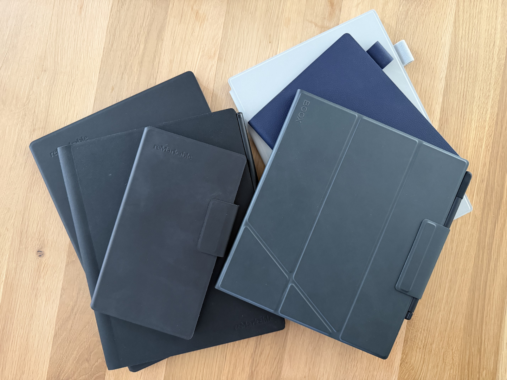

## Intro

I have been using E-ink note-taking devices for years and have owned models from several major brands[^1], including Onyx Boox, Remarkable, and Supernote. After long-term daily use and comparing their strengths and weaknesses, I decided in 2026 to finally settle on the best E-ink note-taking platform for my workflow.

> [!NOTE]
> I am not sponsored or affiliated with any of these companies.

> [!INFO]
> This post is not intended to be a comprehensive review but rather to reflect my opinion. For comprehensive reviews, I can recommend My Deep Guide (YouTube) and Chalid Raqami (YouTube).

## Onyx Boox Note Air 3 C

Honestly, my only Boox device has not been touched for a while. The hardware is gorgeous, and the possibilities are almost on par with a “real” tablet (minus media and games).

### Pros

- It is highly customizable and runs a full Android OS, including the Play Store out of the box, with many configuration options for the Reader and Writer apps.
- It does not flash despite having color (Kaleido 3).
- There are many (physical) pen choices available for the underlying EMR technology.

### Cons

- Many options, many buttons, and nested menus lead to cognitive overload.
- There are privacy concerns[^2], and some solutions (NetGuard, WebDAV / Syncthing) make the device less enjoyable and are not everybody’s taste.
- The operating system does not feel very reliable, and I experienced a few crashes.

## Remarkable

Some pros and cons which affects every Remarkable device.

### Pros

- Devices are based on Linux and very developer-friendly (hackable) out of the box.[^3]
- Remarkable has one of the best cloud/sync experiences.
- A solid mobile App

### Cons

- You need a subscription to access all features.
- You have to trust Remarkable's cloud offering for the best experience. There are workarounds but they are not convenient and because of that you likely don't use the device as much as you would.

## Remarkable 2

My very first E-ink note-taking device, which I purchased second-hand because I was unsure, especially given the premium price. I think it is still a good device, but you can tell its age.

### Pros

- There are many pen choices, as the underlying technology is EMR (as with the Onyx Boox Note Air 3 C).
- No flashing and minimal ghosting.

### Cons

- It has no backlight.
- The reading experience is only mediocre. EPUBs are converted to PDFs on the device, which makes reading EPUBs awkward. PDFs are fine.

## Remarkable Paper Pro

Color and a backlight! A huge step forward for Remarkable, but also with its quirks.

### Pros

- There is a large selection of (software) pens, and they are implemented very well.
- The UI (buttons, menus) is very responsive.

### Cons

- Zooming is painful, especially on colored content.
- Uncomfortable to hold. It is big and heavy and more of a desk device.
- There is a lot of flashing, especially with color.

## Remarkable Paper Pro Move

A portable E-ink device with the form factor of a Traveler’s Notebook.

### Pros

- One-handed use is comfortable.
- The back feels more robust and not as prone to scratches as the Paper Pro.

### Cons

- The scaling between Paper Pro and Move is inconvenient. Either your content is too small (Paper Pro → Move) or it has white margins (Move → Paper Pro).
- You have to get used to the tall dimensions—not so much for carrying, but for writing.

## Supernote A5X2 Manta

No color, no backlight. Clearly inferior to the lineup—or is it?

### Pros

- Provides the best pen haptic. The Metal Pen 2, Lamy Safari Vista EMR, and Push-Up Standard Pen all feel very premium and distinctive.
- Provides the best writing feel for me compared to Remarkable and Onyx Boox devices. It feels not scratchy and very soft and is often compared to a roller ball pen versus a pencil (Remarkable, Boox).
- Offers a pleasant UI that balances features and clutter.
- Good connectivity features. Notable: spinning up a web server to access files through a browser, or selecting folders to sync if you do not want to sync all your data.
- And the killer feature for me: Private cloud! No more wondering whether I can put this data on someone else’s server. Now, everything is on my infrastructure.

### Cons

- Sometimes does not feel as snappy as Remarkable, especially when switching between pen and eraser.
- No backlight.
- Sync is not as mature[^4] as with Remarkable, but it gets the job done.

## Supernote A6X2 Nomad

The Remarkable Paper Pro Move contender that can still be held with one hand. Basically, there is not much difference between the devices, which I like. It is simply a more portable version of the Manta with a “full” cover and therefore feels heavier than the larger Manta. I use the Manta for reading technical documents and drafting ideas, and the Nomad for note-taking, daily planning, grocery lists, etc.

## Verdict

After comparing Onyx Boox, Remarkable, and Supernote devices side by side, I ultimately settled on Supernote as the best E-ink note-taking platform for my needs.
Both the Supernote A5X2 Manta and A6X2 Nomad offer the best balance between focused writing, thoughtful software features, and a distraction-free experience.

The writing feel is superior to both Remarkable and Boox for me, and the addition of a private cloud[^5] — still unique among major E-ink manufacturers — was the final deciding factor.
It gives me full control over my notes without relying on third-party cloud services.

I used to believe color E-ink would make black-and-white devices obsolete. After long-term use, I’ve learned the opposite: for serious note-taking, monochrome E-ink still delivers the best experience.

If you are deciding between Supernote, Remarkable, and Onyx Boox, I hope this comparison helps you to choose the right E-ink note-taking device for your workflow.

[^1]: This blog post is focused on note-taking devices. For reading novels I use a [Tolino Vision Color](https://mytolino.de/produkte/tolino-vision-color/), a branded version of the [Kobo Libra Colour](https://eu.kobobooks.com/products/kobo-libra-colour) and a [xteink X4](https://www.xteink.com/products/xteink-x4). I used to read on a Kindle Oasis but I boycott those devices now.

[^2]: [Mozilla Foundation](https://www.mozillafoundation.org/en/privacynotincluded/onyx-boox/), [My Deep Guide](https://www.youtube.com/watch?v=fQctTrqIQQE) (YouTube)

[^3]: [Awesome Remarkable](https://github.com/reHackable/awesome-reMarkable)

[^4]: They are [working](https://supernote.com/blogs/supernote-blog/talking-about-supernote-s-next-major-software-focus) on it.

[^5]: Yes, various devices can connect to WebDAV or Dropbox (also not private!), etc. Here, I am referring to the manufacturer's own cloud offering.
