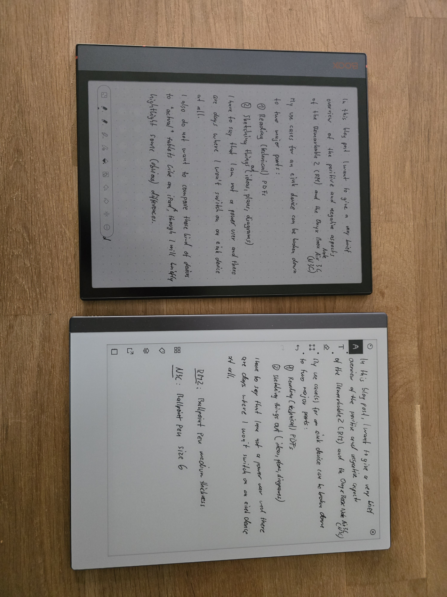
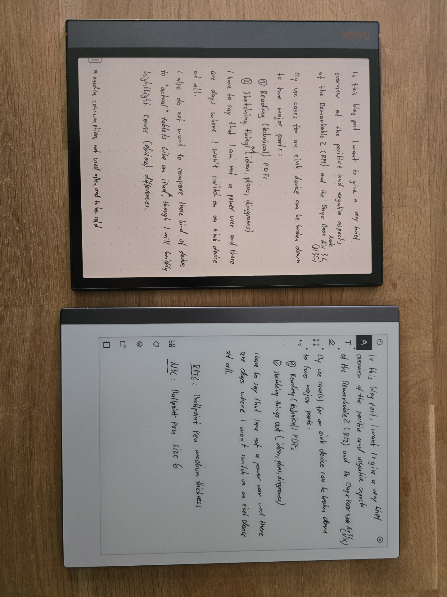
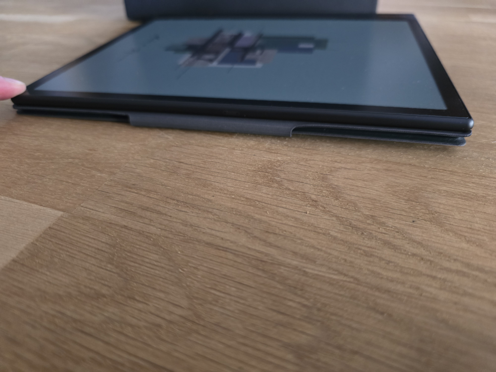
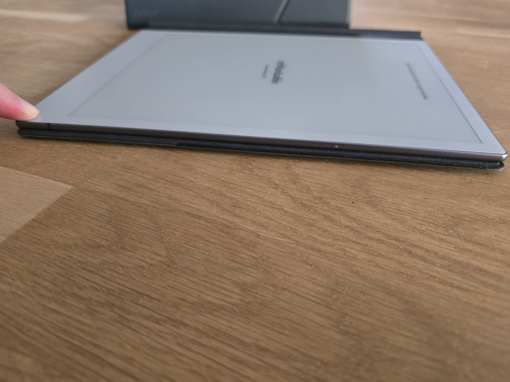


Dieser Beitrag wurde von einer KI ins Deutsche übersetzt. Der englische Originalinhalt wurde von mir verfasst. [Zum englischen Original](https://rootknecht.net/blog/note-air-3-c-vs-remarkable-2/)


## Einleitung

In diesem Blogbeitrag möchte ich kurz die positiven und negativen Aspekte des [Remarkable 2](https://remarkable.com/) (RM2) und des [Onyx Boox Note Air 3 C](https://onyxboox.com/boox_noteair3c) (N3C) vergleichen.


Ich habe beide Geräte mit meinem eigenen Geld gekauft, und es besteht keine Verbindung zu einem der Unternehmen.


Meine primären Anwendungsfälle für solche E-Ink-Geräte lassen sich wie folgt kategorisieren:

1. Technische PDFs, Bücher und Zeitschriften lesen. Für das Lesen von Romanen verwende ich einen Kindle.
2. Ideen, Pläne, Diagramme skizzieren und Brainstorming betreiben.

Ich beabsichtige auch nicht, diese Art von Geräten mit „echten" Tablets wie einem iPad zu vergleichen, obwohl der N3C tendenziell als Allzweck-Tablet funktioniert. Es wird immer durch seine Display-Technologie begrenzt sein.


Das ist meine rein subjektive Meinung, und ich behaupte nicht, dass dies der einzige Standpunkt sein sollte. Ihre Erfahrung kann je nach Anwendungsfall und Vorlieben abweichen.


Ich unterscheide zwischen positiven (gekennzeichnet mit 👍) und negativen (gekennzeichnet mit 👎) Aspekten. Alle Aspekte sind in keiner bestimmten Reihenfolge.

Zunächst werde ich die Hardware genauer betrachten und dann die Software der beiden Geräte untersuchen.

## Hardware

### Remarkable 2

👍 Gummifüße schützen die Rückseite und verhindern das Verrutschen.

👍 Hochwertiges Folio aus Leder.

👍 Starker Stiftmagnet.

👍 Großartiges Design.

👍 Fantastische Akkulaufzeit.

👍 Große Bezels ermöglichen ein einfaches Greifen.

👍 Leichter als der N3C.

👍 Display hat mehr Kontrast (siehe [Eindrücke](#impressions)).

---

👎 Gummifüße zwingen dazu, das Gerät anzuheben, anstatt es einfach auf der Fläche zu verschieben (siehe [Eindrücke](#impressions)).

👎 Nur 8 GB nicht erweiterbarer Speicher, abzüglich des Betriebssystems.

👎 Große Bezels.

👎 Keine Hintergrundbeleuchtung.

### Note Air 3 C

👍 Hintergrundbeleuchtung.

👍 64 GB interner Speicher, abzüglich des Betriebssystems.

👍 Micro-SD-Kartensteckplatz.

👍 Großartiges Design, besonders die orangefarbenen Akzente.

👍 Farbiges E-Ink-Display.

👍 Bluetooth.

👍 Lautsprecher.

👍 Leistungsstärker.

👍 Kleinere Bezels.

👍 Keine Gummifüße, sodass das Gerät leicht auf der Fläche geschoben werden kann, ohne es greifen zu müssen.

---

👎 Das Folio fühlt sich weniger hochwertig an, bietet aber eine Standfunktion (vertikal und horizontal).

👎 Die Stiftlasche des Folios ist nicht sehr nützlich und verhindert, dass das Gerät flach liegt, wenn es nach hinten gedreht wird (siehe [Eindrücke](#impressions)).

👎 Keine Gummifüße zum Schutz des Geräts und zum Verhindern des Verrutschens.

👎 Der Ein-/Ausschalter ist zu versteckt im Case und fühlt sich nicht taktil an, um ihn zu drücken oder sogar zu finden (siehe [Eindrücke](#impressions)).

👎 Der Radierer des Stifts fühlt sich extrem unangenehm an.

👎 Kleinere Bezels bieten weniger Fläche zum Greifen.

👎 Schwacher Stiftmagnet.

👎 „OK" Akkulaufzeit für so viele Features und Leistung, aber im Vergleich zum RM2 sehr schlecht.

👎 Schwerer als der RM2.

👎 Etwas weniger Kontrast (siehe [Eindrücke](#impressions)).

Jetzt werde ich mit den Überarbeitungen für den Software-Abschnitt fortfahren.

## Software

### Remarkable 2

👍 Sehr saubere und einfache Benutzeroberfläche.

👍 Mehr und etwas bessere Pinsel.

👍 Hacker-freundliches Betriebssystem basierend auf Linux.

👍 SSH direkt und offiziell unterstützt.

---

👎 Für notwendige Funktionen ist ein Abonnement erforderlich (betreffend persönliche Daten auf deren Servern, nicht die Kosten).

👎 Hosting von [rmfakecloud](https://github.com/ddvk/rmfakecloud), wenn kein Abonnement eine Option ist (unbeschadet der lobenswerten Arbeit des Entwicklers für die RM2-Community).

👎 Die [Lamy](https://shop.lamy.com/de_de/digital-writing-lamy-safari-twin-pen-all-black-emr.html#stylus_nib=7575)-Stifttaste funktioniert ohne einen Workaround nicht.

👎 Es ist schwierig, Dokumente zum und vom Gerät zu übertragen, insbesondere mit Anmerkungen (und ohne Abonnement).

👎 Kein offizieller Drittanbieter-App-Store (siehe [Awesome Remarkable](https://github.com/reHackable/awesome-reMarkable)).

### Note Air 3 C

👍 Unterstützt eine breite Palette von Leseformaten.

👍 Viele Konnektivitätsoptionen einschließlich WebDAV (NextCloud) direkt nach dem Auspacken.

👍 Zugang zum Google Play Store.

👍 Sideloading von APKs (F-Druid usw.).

👍 Bietet mehr Ablenkungen.

👍 Unkomplizierter Export von annotierten PDFs.

👍 Läuft auf Android.

👍 Hochgradig anpassbar.

👍 Die [Lamy](https://shop.lamy.com/de_de/digital-writing-lamy-safari-twin-pen-all-black-emr.html#stylus_nib=7575)-Stifttaste funktioniert direkt nach dem Auspacken.

---

👎 Läuft auf Android 🤣

👎 Hochgradig anpassbar 🤣

👎 Begrenzte exponierte Android-Einstellungen (vollständige Einstellungen mit einem Workaround verfügbar, z. B. Nova Launcher).

👎 Unfähigkeit, Onyx-Konto-Werbung in den Einstellungen auszublenden.

👎 Überladene Benutzeroberfläche.

👎 Gelegentliche Abstürze und Einfrierungen.

👎 Datenschutzbedenken (TLDR: Ich verwende [NetGuard](https://netguard.me/) zum Filtern/Blockieren des Netzwerkverkehrs)[^1].

## Eindrücke

Das erste Bild zeigt den N3C mit ausgeschalteter Hintergrundbeleuchtung, das zweite mit Hintergrundbeleuchtung und Farbtemperatur auf 50 % eingestellt.





Dieses Bild zeigt die Rückseite beider Geräte. Die Gummifüße sind deutlich sichtbar.



Das erste Bild zeigt den N3C mit umgeklappter Stiftlasche. Man kann sehen, dass er dadurch nicht flach liegt und auf dem Tisch wackelt, wenn ich mit dem Finger darauf drücke. Wenn die Lasche nicht heruntergeklappt ist, stört sie beim Schreiben (für Rechtshänder), weil sie nicht flach auf der Fläche liegt.

Das zweite Bild zeigt den RM2, der trotz des starken Drucks meiner nun weißen Fingerkuppe flach auf dem Tisch liegt.





Dieses Bild veranschaulicht ein recht leistungsfähiges Schreib-Setup. Natürlich ist beim Verwenden einer (mechanischen!) Bluetooth-Tastatur der angeschlossene kabellose Logitech-Adapter nicht erforderlich. Die integrierte Maus wird ebenfalls erkannt und funktioniert.



Dieses Bild zeigt die Ein-/Ausschalter. Man sieht, dass der Ein-/Ausschalter des RM2 viel taktiler ist.



## Fazit

Meiner Meinung nach glänzt der RM2 in zwei Bereichen:

1. Ablenkungen fernhalten. Ich bevorzuge es, meinen RM2 wie ein Blatt Papier zu verwenden, und das ist in Ordnung, weil das sein ursprünglicher Zweck war.
2. Eine einfache, aber umfassende Benutzeroberfläche, die nicht überfordert oder dazu verleitet, übermäßig an Einstellungen zu schrauben.

Der N3C glänzt in folgenden Bereichen:

1. Wenn man die volle Flexibilität wünscht, die Android bietet.
2. Wenn man ein Gerät möchte, das einem „echten" Tablet nahekommt.

Dennoch wird der N3C mein primäres Gerät für die genannten Anwendungsfälle sein.

Die Gründe für diese Wahl sind folgende:

- Android und seine flexible Integration mit der „Außenwelt". [Syncthing](https://play.google.com/store/apps/details?id=com.nutomic.syncthingandroid), [Nextcloud](https://play.google.com/store/apps/details?id=com.nextcloud.client), [calibre-companion](https://play.google.com/store/apps/details?id=com.multipie.calibreandroid), [Localsend](https://play.google.com/store/apps/details?id=org.localsend.localsend_app) und [Obsidian](https://play.google.com/store/apps/details?id=md.obsidian) sind wesentliche Bestandteile meines plattformübergreifenden (Linux, iOS, macOS, Android) Workflows und funktionieren nahtlos auf dem N3C.
- Kein obligatorisches Abonnement.
- Die bequeme Präsenz einer Hintergrundbeleuchtung.
- Das Vorhandensein von Farben ist zwar kein Killer-Feature, fügt aber eine nette Note hinzu.

Trotz dieser Vorteile gibt es einige Aspekte des N3C, die mir nicht gefallen:

- Gelegentliche Abstürze und Einfrierungen, die zu Datenverlust führen können, weil Notizen nicht automatisch gespeichert werden, sondern nur durch Drücken einer Schaltfläche oder durch Verlassen einer Notiz.
- Die überladene Benutzeroberfläche und verschachtelte Optionen können manchmal überwältigend sein.
- Das Fehlen einer Doppeltippen-Geste (Rückgängig), eine Funktion, an die ich mich von meinem RM2 gewöhnt hatte.

[^1]: Es gibt einige YouTube-Videos, die Datenschutzbedenken ansprechen: [1](https://www.youtube.com/watch?v=ObtjXO_hEPw), [2](https://www.youtube.com/watch?v=fQctTrqIQQE) und [3](https://www.youtube.com/watch?v=jBg51mMuYgI).
