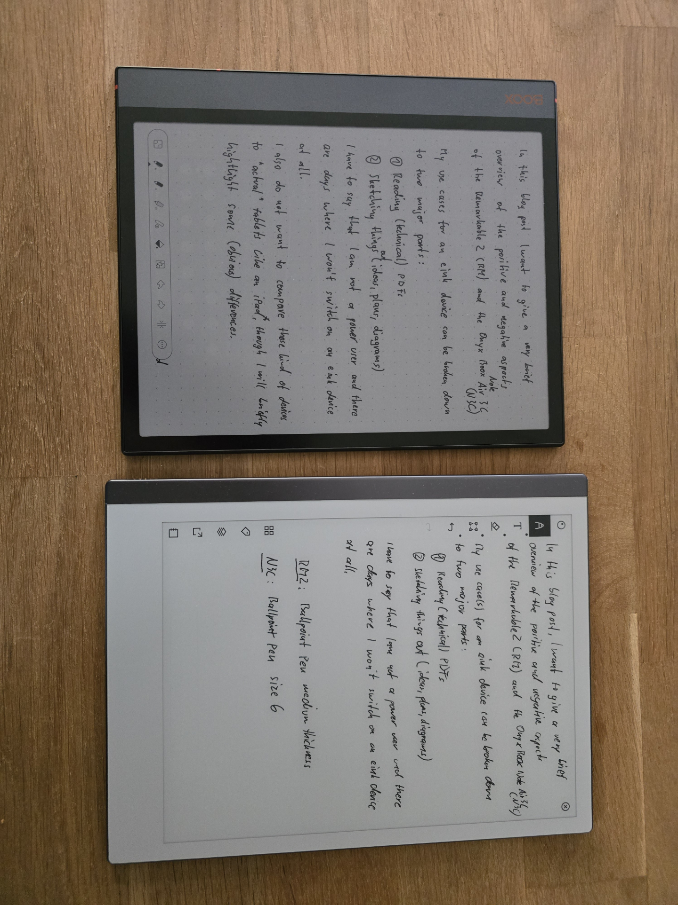
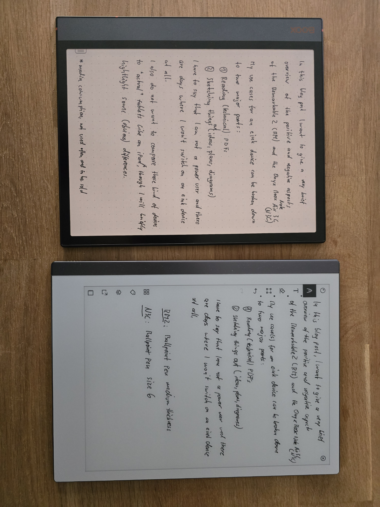
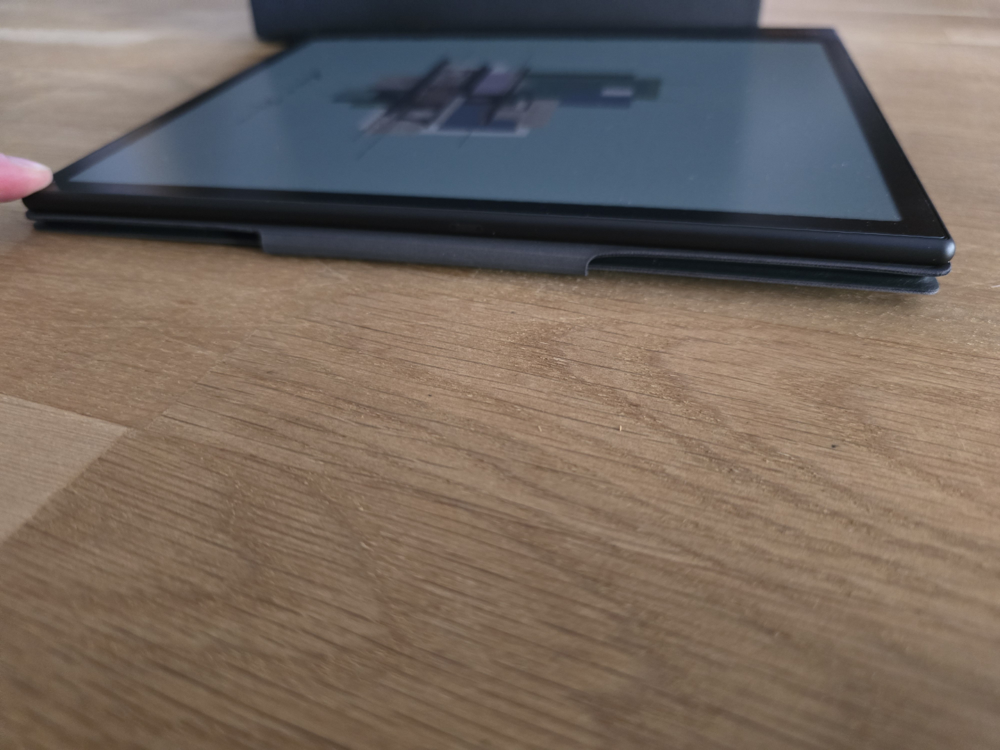
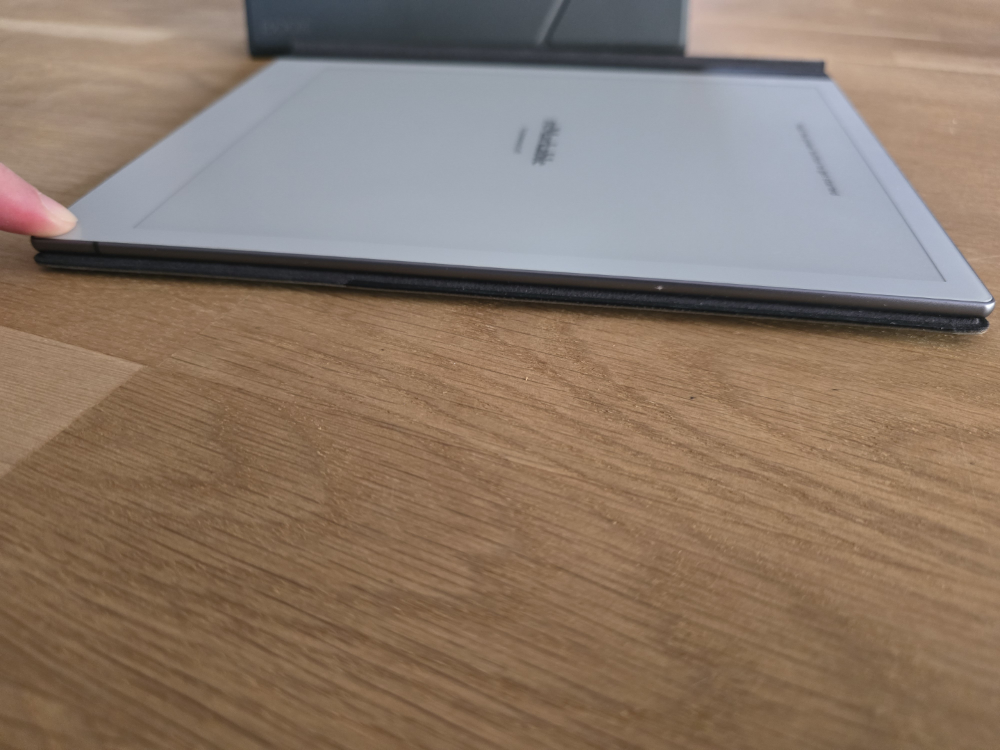

## Introduction

In this blog post, I want to briefly compare the positive and negative aspects of the [Remarkable 2](https://remarkable.com/) (RM2) and the [Onyx Boox Note Air 3 C](https://onyxboox.com/boox_noteair3c) (N3C).


I purchased both devices with my own money, and there is no affiliation with either company.


My primary use cases for such E-ink devices can be categorized as follows:

1. Reading technical PDFs, books, and magazines. For reading novels, I use a Kindle.
2. Sketching out ideas, plans, diagrams, and brainstorming.

I also do not intend to compare these types of devices to "actual" tablets like an iPad, even though the N3C tends to function as a general-purpose tablet. However, it will always be limited by its display technology.


This is purely my subjective opinion, and I do not assert that this should be the only viewpoint. Your experience may vary depending on your use case and preferences.


I will distinguish between positive (indicated by 👍) and negative (indicated by 👎) aspects. All aspects are in no particular order.

First, I will take a closer look at the hardware and then examine the software of the two devices.

## Hardware

### Remarkable 2

👍 Rubber feet protect the back and prevent sliding.

👍 High-quality folio made from leather.

👍 Strong pen magnet.

👍 Great design language.

👍 Awesome battery life.

👍 Large bezels allow for easy gripping.

👍 Lighter than the N3C.

👍 Display has more contrast (see [Impressions](#impressions)).

---

👎 Rubber feet cause you to lift the device rather than simply move it on the surface (see [Impressions](#impressions)).

👎 Only 8 GB of non-extendable storage, minus the OS.

👎 Large bezels.

👎 No backlight.

### Note Air 3 C

👍 Backlight.

👍 64 GB of internal storage, minus the OS.

👍 Micro SD card slot.

👍 Great design, especially the orange highlights.

👍 Colored E-ink display.

👍 Bluetooth.

👍 Speaker.

👍 More powerful.

👍 Smaller bezels.

👍 No rubber feet, allowing the device to be easily slid on the surface without the need for grabbing it.

---

👎 The folio feels less premium but includes a stand feature (vertical and horizontal).

👎 The folio's pen flap is not very useful and causes the device to not lie flat when turned to the back (see [Impressions](#impressions)).

👎 No rubber feet to protect the device and prevent sliding around.

👎 The power button is too hidden in the case and not tactile to press or even find (see [Impressions](#impressions)).

👎 The pen's eraser feels extremely awkward.

👎 Smaller bezels provide less space to grip.

👎 Weak pen magnet.

👎 "OK" battery life for that many features and power, but in comparison to the RM2, it is very bad.

👎 Heavier than the RM2.

👎 Slightly less contrast (see [Impressions](#impressions)).

I will now proceed to the revisions for the Software section.

## Software

### Remarkable 2

👍 Very clean and simple UI.

👍 More and slightly better brushes.

👍 Hacker-friendly operating system based on Linux.

👍 SSH out of the box and officially supported.

---

👎 A subscription for necessary features is required (concerning personal data on their servers, not costs).

👎 Hosting of [rmfakecloud](https://github.com/ddvk/rmfakecloud) when a subscription is not an option (notwithstanding the commendable work done by the dev for the RM2 community).

👎 The [Lamy](https://shop.lamy.com/de_de/digital-writing-lamy-safari-twin-pen-all-black-emr.html#stylus_nib=7575) pen button does not work without a workaround.

👎 It is difficult to transfer documents to and from the device, especially with annotations (and without a subscription).

👎 Absence of an official third-party application store (see [Awesome Remarkable](https://github.com/reHackable/awesome-reMarkable)).

### Note Air 3 C

👍 Supports a wide range of reading formats.

👍 Many connectivity options including WebDAV (NextCloud) out of the box.

👍 Google Play Store access.

👍 Side-loading APKs (F-Druid, etc.).

👍 Offers more distractions.

👍 Straightforward export of annotated PDFs.

👍 Runs on Android.

👍 Highly customizable.

👍 The [Lamy](https://shop.lamy.com/de_de/digital-writing-lamy-safari-twin-pen-all-black-emr.html#stylus_nib=7575) pen button works out of the box.

---

👎 Runs on Android 🤣

👎 Highly customizable 🤣

👎 Limited exposed Android settings (full settings available with a workaround, e.g., Nova Launcher).

👎 Inability to hide Onyx account advertisement in settings.

👎 Cluttered UI.

👎 Occasional crashes and freezes.

👎 Privacy concerns (TL;DR I use [NetGuard](https://netguard.me/) to filter/block network traffic)[^1].

## Impressions

The first image shows the N3C with backlight turned off and the second image with the backlight and color temperature set to 50%.





This image shows the back of both devices. The rubber feet are noticeable.



The first picture shows the N3C with the pen flap flipped over. You can see that it doesn't sit flat because of this and wobbles on the table when I press my finger on it. If the tab is not folded down, it interferes with writing (for right-handed people) because it does not stay flat on the surface.

The second picture shows the RM2, which remains flat on the table despite the large pressure from my now white fingertip.




This image illustrates a rather capable writing setup. Of course, when using a (mechanical!) Bluetooth keyboard, the attached wireless Logitech adapter is not needed. The integrated mouse is also detected and working.



This image shows the power buttons. You can see that the RM2's power button is much more tactile.



## Verdict

In my opinion, the RM2 excels in two areas:

1. Keeping distractions at bay. I prefer to use my RM2 as I would a sheet of paper, and that's okay because that's what it was originally intended for.
2. A simple yet comprehensive UI that doesn't overwhelm or tempt you to tweak settings excessively.

The N3C shines in the following areas:

1. If you desire the full flexibility that Android offers.
2. If you want a device that closely resembles a "real" tablet.

Having said that, the N3C will be my primary device for the aforementioned use cases.

The reasons for this choice are as follows:

- Android, and its flexible integration with the "outside world". [Syncthing](https://play.google.com/store/apps/details?id=com.nutomic.syncthingandroid), [Nextcloud](https://play.google.com/store/apps/details?id=com.nextcloud.client), [calibre-companion](https://play.google.com/store/apps/details?id=com.multipie.calibreandroid), [Localsend](https://play.google.com/store/apps/details?id=org.localsend.localsend_app), and [Obsidian](https://play.google.com/store/apps/details?id=md.obsidian) are essential components of my cross-platform (Linux, iOS, macOS, Android) workflow and function seamlessly on the N3C.
- Absence of a mandatory subscription.
- The convenient presence of a backlight.
- The inclusion of colors, while not a killer feature, adds a nice touch.

Despite these advantages, there are a few aspects of the N3C that I am not fond of:

- Occasional crashes and freezes that may result in data loss because notes are not automatically saved, only upon pressing a button or exiting a note.
- The cluttered user interface and nested options can be overwhelming at times.
- The absence of a double-tap gesture (undo), a feature that I have grown accustomed to from my RM2.

[^1]: There are some YouTube videos addressing privacy concerns: [1](https://www.youtube.com/watch?v=ObtjXO_hEPw), [2](https://www.youtube.com/watch?v=fQctTrqIQQE), and [3](https://www.youtube.com/watch?v=jBg51mMuYgI)
